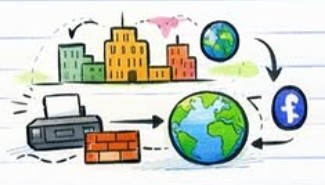
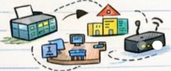

# INTRODUCTION TO COMPUTER NETWORKS

## What is Computer Network?

- A computer network is a system where multiple devices are connected to share **data** & **resources**.


- Simple Definition:

```
Network = Devices + Medium + Protocols
      └─► Wires/ Wifi ─► *Rules* (Protocols)
```

##  Why Networks Are Important?

✅ Data Sharing


✅ Internet Access
✅ Resource Sharing (Printer, Files)
✅ Communication (Email, Chat)
✅ *Cloud Services*

## Components of Data Communication


## Types of Networks

- 🏠 **LAN:** Local Area (Office)
- 🏢 **MAN:** Metropolitan Area (City)
- 🌍 **WAN:** Wide Area Networ (World)
- 📱 **PAN:** Personal Area Network (Bluetooth)



## Real Work Example



- Employees on -**LAN**
- Router to Internet
- **Firewall** for **Security**


# NETWORK TOPOLOGY & TRANSMISSION MODES