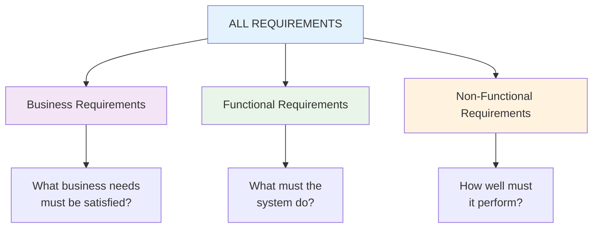

# Types of Requirements

**Tags:** #SAD #Requirements #Functional #NonFunctional #BusinessRequirements #Classification
**Last Reviewed:** February 2, 2026

---

## Overview

Requirements classification is fundamental to successful system analysis. Different types of requirements serve different purposes and require different validation approaches.

**Key Principle:** *"Every requirement has a type, priority, and validation method."*

## The Three Main Requirement Categories

┌──────────────┐   ┌──────────────┐   ┌──────────────┐
│   BUSINESS   │   │     USER     │   │    SYSTEM    │
│ Requirements │   │ Requirements │   │ Requirements │
└──────────────┘   └──────────────┘   └──────────────┘
   (WHY)              (WHO needs)        (WHAT & HOW)
   Goals              Stories & Needs    Functional & 
   

## Business Requirements (The "WHY")

- High-level organizational goals.
- **Stakeholders:** CEOs, Managers.
- **Format:** SMART objectives.

*Example: "Increase local artisan sales by 10% within 1 year."*

## User Requirements (The "WHO needs WHAT")

- End-user needs and expectations.

- **Format:** User Stories (As a... I want... So that...).

    *Example: "As an artisan, I want to list products online so I can reach more customers."*

## System Requirements (The "WHAT & HOW" of the system)

- Detailed specifications of what the system must do and how.
- **Two Subtypes:**
    - **Functional Requirements:** Features, functions, executable parts.
        *Example: "System shall allow users to search products by category."*
    - **Non-Functional Requirements (NFRs):** System qualities, constraints, "environmental variables."
        - Analogy from notes: "The bottle mouth size" that controls flow.
            *Example: "System shall load search results in <2 seconds for 1000+ users."*

## The Critical Relationship

- **Business Requirements** drive **User Requirements**.
- **User Requirements** translate into **System Requirements**.
- **Functional Features** must satisfy **both** user needs AND business goals.

## The "Problem Statement" Focus (From Notes)

- **Golden Rule:** "Our solution has to be for the problem statement only."
- **Don't over-engineer:** "Do make systems to solve all world problems." ← (Sarcastic warning against scope creep)

## Related Links

← **Synthesizes:** [All previous pages in Section 1]()
→ **Leads to:** [Section Group 2 (SDLC Models where this is applied)]()