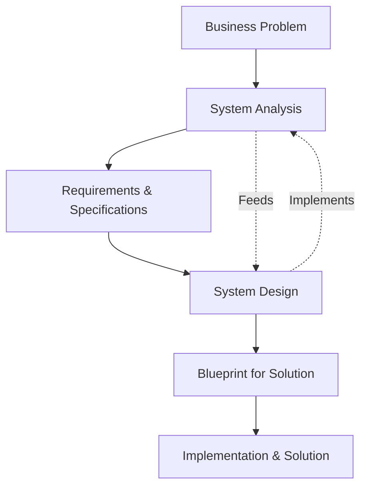

# Introduction to System Analysis and Design

**Tags:** #SAD #Fundamentals #Analysis #Design #CoreConcepts
**Last Reviewed:** February 2, 2026

---

## 1. System Analysis

**Definition:** The process of studying an existing system (or business need) to identify its objectives, requirements, and problems.

**Key Characteristics:**
- **Focus:** Understanding the "what" and "why"
- **Key Question:** "What does the business need, and what problems are we solving?"
- **Activities:** Gathering requirements, analyzing processes, modeling current systems, identifying gaps

## 2. System Design

**Definition:** The process of planning and specifying a new system that meets the requirements identified during analysis.

**Key Characteristics:**
- **Focus:** Creating the "how"
- **Key Question:** "How will we build a system to meet these needs?"
- **Activities:** Architectural design, interface design, database design, specifying software/hardware

## 3. The Relationship between Analysis & Design

**Key Principle:** *Analysis feeds design; design implements analysis*

## 4. Importance of SAD

| Benefit | Description | Impact |
|---------|-------------|--------|
| **Business Alignment** | Ensures technology solutions solve real business problems | Strategic value delivery |
| **Complexity Management** | Breaks down large problems into manageable parts | Reduced project risk |
| **Risk Reduction** | Identifies issues before building (saves time/money) | Cost and time savings |
| **Communication** | Creates common language between stakeholders | Improved collaboration |
| **Quality Assurance** | Structured approach leads to robust, maintainable systems | Long-term reliability |

## 5. SAD Mindset: Think like an Analyst

**Core Principles:**
- **Problem-Oriented Approach:** Understand the root cause before jumping to solutions
- **Dual Perspective:** See both the big picture and the details (forest and trees)
- **Multi-Language Communication:** Speak business language, technical specs, and visual models
- **Change Adaptation:** Requirements evolve; design must adapt

## 6. Real-World Analogy: Building a House

| Phase | House Building | System Development |
|-------|----------------|--------------------|
| **Analysis** | Talk to family about needs, survey land, check zoning laws | Gather business requirements, assess current system, identify constraints |
| **Design** | Create blueprints, electrical plans, material lists | Design architecture, interfaces, database schema |
| **Without SAD** | Start building and hope it works out | Start coding without planning (recipe for disaster) |

## Examples

**E-Commerce System:**
- **Analysis:** What products to sell? How should checkout work? What payment methods?
- **Design:** Database structure, user interface layout, payment processing flow

**Library Management System:**
- **Analysis:** How do users find books? What checkout process? Overdue handling?
- **Design:** Search algorithms, user interface, automated notification system

## Exercise

**Scenario:** A small restaurant wants to implement an online ordering system.
1. List 3 analysis questions you would ask
2. Identify 2 design decisions that would need to be made
3. What could go wrong without proper SAD?

## Related Concepts

- **Previous:** [General System Model](intro_to_systems/)
- **Next:** [The Systems Analyst Role](1.5%20-%20The_Systems_Analyst_Role.md)
- **See Also:** [SDLC Overview](1.6%20-%20SDLC_Overview.md)