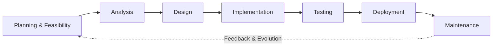

# Software Development Life Cycle (SDLC) Overview

**Tags:** #SAD #SDLC #Framework #Process #Methodology
**Last Reviewed:** February 2, 2026

---

## 1. What is the SDLC?

**Definition:** A structured, phased process for planning, creating, testing, and deploying information systems.

**Primary Purpose:** To produce high-quality software that meets user expectations, delivered on time and within budget.

**Core Philosophy:** Break down complex development into manageable, sequential stages with clear deliverables and checkpoints.

## 2. Why is the SDLC Important?

| Benefit | Description | Impact |
|---------|-------------|--------|
| **Systematic Development** | Reduces chaos and "code-and-fix" approaches | Predictable, organized process |
| **Quality Improvement** | Built-in validation and testing phases | Higher-quality end products |
| **Risk Management** | Identifies issues early when cheaper to fix | Reduced project failure rates |
| **Enhanced Communication** | Clear deliverables align all stakeholders | Better team coordination |
| **Project Control** | Milestones and reviews keep projects on track | Improved timeline and budget adherence |

## 3. Generic SDLC Phases (The "Big Picture")

### Phase Breakdown

| Phase | Key Question | Primary Focus | Duration |
|-------|-------------|---------------|----------|
| **Planning & Feasibility** | "Should we do this project?" | Business justification, resource planning | 5-15% |
| **Analysis** | "What do we need to build?" | Requirements gathering, problem understanding | 15-25% |
| **Design** | "How will we build it?" | Architecture, specifications, blueprints | 15-20% |
| **Implementation** | "Building it" | Coding, development, configuration | 30-40% |
| **Testing** | "Did we build it correctly?" | Quality assurance, validation | 15-25% |
| **Deployment** | "Releasing it to users" | Go-live, training, rollout | 5-10% |
| **Maintenance** | "Keeping it running" | Support, enhancements, bug fixes | Ongoing |

## 4. The Phase-Deliverable Concept

**Key Principle:** Each phase produces specific, measurable deliverables that serve as inputs for subsequent phases.

### Typical Deliverables by Phase

| Phase | Key Deliverables | Stakeholder Use |
|-------|------------------|----------------|
| **Planning** | • Feasibility Study Report • Project Charter • Business Case | Decision-making, resource allocation |
| **Analysis** | • Requirements Specification • Use Case Diagrams • Business Process Models | Understanding scope and needs |
| **Design** | • System Architecture Document • Database Schema • UI Mockups • Technical Specifications | Development guidance |
| **Implementation** | • Source Code • Unit Tests • Technical Documentation | System construction |
| **Testing** | • Test Plans & Cases • Bug Reports • Test Results • Quality Metrics | Quality validation |
| **Deployment** | • User Manuals • Training Materials • Installation Guides | User adoption |
| **Maintenance** | • Support Documentation • Change Requests • Performance Reports | Ongoing operations |

## 5. Iteration in the SDLC

**Modern Reality:** Not all projects follow a linear path. Many methodologies use iterative cycles.

### Iterative Approach Benefits
- **Early Feedback:** Get user input before major investment
- **Risk Reduction:** Address problems incrementally
- **Flexibility:** Adapt to changing requirements
- **Value Delivery:** Deliver working features progressively

**Key Philosophy:** *"Get feedback early and often, refine the system incrementally."*

### Example: Social Media Feature Development
**Iteration 1:** Basic posting functionality  
**Iteration 2:** Add image upload  
**Iteration 3:** Implement commenting  
**Iteration 4:** Add sharing capabilities

## 6. Predictive vs. Adaptive SDLC Approaches

| Aspect | Predictive (Plan-Driven) | Adaptive (Change-Driven) |
|---|---|---|
| **Philosophy** | Plan the entire project upfront | Plan incrementally, adapt to change |
| **Requirements** | Stable, well-understood | Volatile, evolving, exploratory |
| **Feedback** | At major milestones | Continuous, every iteration |
| **Documentation** | Comprehensive, detailed | Lightweight, just enough |
| **Team Structure** | Specialized roles | Cross-functional teams |
| **Examples** | Waterfall, V-Model | Agile, Scrum, XP, Kanban |
| **Best For** | Safety-critical systems, regulated industries | Innovation projects, fast-changing markets |
| **Risk Management** | Upfront analysis | Iterative discovery |

### When to Choose Which?

**Choose Predictive when:**
- Requirements are well-understood and stable
- Safety or regulatory compliance is critical
- Team is distributed or less experienced

**Choose Adaptive when:**
- Requirements are unclear or likely to change
- Speed to market is important
- Innovation and experimentation are valued 

## 7. Real-World Example: Instagram Stories Feature

**Planning:** Analyze competitor features, assess user demand  
**Analysis:** Define story requirements (24-hour lifecycle, media types)  
**Design:** UI mockups, backend architecture for temporary content  
**Implementation:** Develop story creation, viewing, and expiration logic  
**Testing:** User acceptance testing, performance testing  
**Deployment:** Gradual rollout to user segments  
**Maintenance:** Monitor usage, fix bugs, add enhancements

## Exercise

**Scenario:** Your university wants to develop a new course registration system.

1. List two deliverables you'd expect from the Analysis phase
2. Which approach would you recommend: Predictive or Adaptive? Why?
3. What could go wrong if you skip the Testing phase?

## Related Concepts

- **Previous:** [The Systems Analyst Role](1.5%20-%20The_Systems_Analyst_Role.md)
- **Next:** [Detailed SDLC Models](../../02-SDLC-Models-Methodologies/01-Traditional-Sequential-Models.md)
- **See Also:** [Agile vs Traditional Methods](../../02-SDLC-Models-Methodologies/06-Agile-Methodology.md)