# MoSCoW Priority Method

**Tags:** #SAD #Prioritization #ScopeManagement #StakeholderAlignment #ResourcePlanning
**Last Reviewed:** February 2, 2026

---

## Overview

The **MoSCoW Priority Method** is a powerful prioritization framework used to reach consensus with stakeholders on what will and won't be delivered in a project iteration or release. It's crucial for managing scope, expectations, and resource allocation effectively.

**Origin:** Developed by Dai Clegg at Oracle for rapid application development  
**Key Benefit:** *Transforms subjective priorities into objective delivery decisions*

```mermaid
flowchart TD
    A[All Requirements] --> B{MoSCoW Analysis}
    B --> C["🔴 MUST HAVE<br/>100% Delivery<br/>Critical for success"]
    B --> D["🟡 SHOULD HAVE<br/>~80% Delivery<br/>Important but flexible"]
    B --> E["🟢 COULD HAVE<br/>~20% Delivery<br/>Nice to have"]
    B --> F["⚪ WON'T HAVE<br/>0% This Release<br/>Future consideration"]
    
    C --> G[Release Planning]
    D --> G
    E --> G
    F --> H[Future Backlog]
    
    style C fill:#ffebee
    style D fill:#fff3e0
    style E fill:#e8f5e8
    style F fill:#f5f5f5
```

## The Four Priority Categories

### Priority Matrix with Decision Criteria

| Category | Description | Delivery % | Decision Criteria | Resource Allocation |
|----------|-------------|------------|-------------------|--------------------|
| **🔴 MUST HAVE** | Non-negotiable requirements. System cannot function without these. | 100% | Business-critical, legal compliance, system won't work without it | Highest priority, dedicated resources |
| **🟡 SHOULD HAVE** | Important but not vital. Strongly desired but workarounds exist. | ~80% | Significant business value, user satisfaction impact | Secondary priority, shared resources |
| **🟢 COULD HAVE** | Nice-to-have. Desirable but not necessary. Low impact if omitted. | ~20% | Marginal improvement, competitive advantage | Lowest priority, leftover resources |
| **⚪ WON'T HAVE** | Explicitly out of scope for this release (but maybe future). | 0% | Beyond current capacity, future consideration | No current resources, future planning |

### Implementation Flow & Strategy

```mermaid
flowchart LR
    A[Project Start] --> B["🔴 Deliver ALL<br/>MUST HAVE"]
    B --> C{Resources<br/>Available?}
    C -->|Yes| D["🟡 Deliver SOME<br/>SHOULD HAVE"]
    C -->|No| E[Release Phase 1]
    D --> F{Resources<br/>Available?}
    F -->|Yes| G["🟢 Deliver FEW<br/>COULD HAVE"]
    F -->|No| E
    G --> E
    E --> H["Plan Next Release<br/>with remaining items"]
    
    style B fill:#ffebee
    style D fill:#fff3e0
    style G fill:#e8f5e8
```

**Key Memory Device:**
- **MoSCoW** = In Scope (M, S, C)
- **COW** = Out of Current Scope (C partial delivery, W completely out)
- **Flow:** MUST → (if resources allow) → SHOULD → (if resources allow) → COULD

# 4. Practical Application in SAD:

- **After Requirements Gathering:** Classify each requirement as M/S/C/W.

- **During Client Negotiation:** "We can deliver all MUSTs and 80% of SHOULDs within budget."

- **Scope Control:** When new requests come: "Is this a MUST or SHOULD? If C or W, it goes to next phase."

# 5. *Example: University LMS Feature Prioritization*

- ***MUST:** User login, course enrollment, grade submission.*

- ***SHOULD:** Mobile app, discussion forums, calendar sync.*

- ***COULD:** Gamification badges, AI tutoring suggestions.*

- ***WON'T:** Virtual reality classrooms, blockchain credentialing (for V1).*

# 7. Links:

- **Related to:** [1.7 As-Is vs To-Be Analysis](../Foundations%20and%20Core%20Concepts/1.7%20-%20As-Is_Vs_To-Be_Analysis.md)

- **Forward to:** [1.11 Types of Requirements](1.11%20-%20Types_of_Requirements.md)