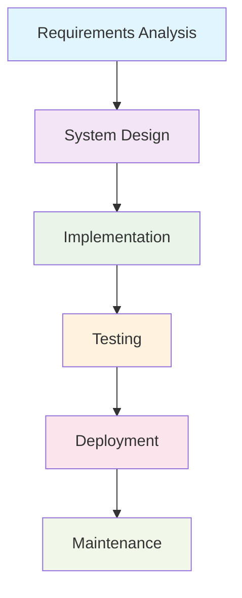

# Traditional Sequential SDLC Models

**Tags:** #SDLC #Sequential #Traditional #Waterfall #VModel #Predictive
**Last Reviewed:** February 2, 2026

---

## Overview

Traditional sequential models follow a **linear, step-by-step approach** to software development where each phase must be completed before moving to the next. These models emphasize thorough documentation, comprehensive planning, and sequential execution.

**Philosophy:** *"Plan once, execute systematically, deliver predictably."*

## Key Characteristics

| Characteristic | Description | Impact |
|---------------|-------------|--------|
| **Linear Progression** | Each phase has specific deliverables; no phase begins until previous is complete | Clear milestones, sequential execution |
| **Documentation Heavy** | Detailed requirements, extensive design specs, formal reviews | Comprehensive project records |
| **Risk Management** | Risks identified early, formal change control processes | Controlled, predictable development |
| **Quality Gates** | Formal approval required at each stage | Built-in quality assurance |

### Sequential Flow Visualization

## Advantages vs. Disadvantages

| Advantages ✅ | Disadvantages ❌ |
|-------------|----------------|
| **Predictability:** Clear timeline, well-defined deliverables | **Inflexibility:** Difficult to accommodate changes |
| **Quality Assurance:** Multiple review points, comprehensive testing | **Late Integration:** System integration occurs late in cycle |
| **Management Control:** Easy to track progress, clear accountability | **Resource Intensive:** Heavy documentation, extended timelines |
| **Risk Management:** Formal processes, controlled changes | **Late Feedback:** Customer input comes late in process |
| **Documentation:** Well-documented processes, formal quality gates | **High Cost of Change:** Expensive to fix defects discovered late |

## Common Traditional Models

### 1. Waterfall Model 🌊
- **Approach:** Pure sequential, one-way flow
- **Strength:** Strong documentation, clear phases
- **Best For:** Well-understood, stable projects
- **Example:** Government systems, regulatory compliance projects

### 2. V-Model 🔼
- **Approach:** Testing planned alongside development phases
- **Strength:** Quality built into each phase
- **Best For:** Quality-critical applications
- **Example:** Medical devices, automotive systems

### 3. Incremental Model 🔄
- **Approach:** System built and delivered in increments
- **Strength:** Early delivery of working software
- **Best For:** Large systems with identifiable modules
- **Example:** Enterprise software suites, complex databases

## When to Use Traditional Sequential Models

### Decision Matrix

| Factor | Traditional Sequential | Score (1-5) |
|--------|----------------------|-------------|
| **Requirements Stability** | Well-understood, unlikely to change | 5 |
| **Project Size** | Large, complex systems | 4 |
| **Team Experience** | Experienced team available | 4 |
| **Quality Requirements** | Critical safety/quality systems | 5 |
| **Regulatory Compliance** | Formal documentation required | 5 |
| **Budget/Timeline** | Fixed budget and timeline | 4 |
| **Customer Availability** | Customer understands domain well | 4 |

### Ideal Project Characteristics

✅ **Perfect Fit:**
- Banking systems, healthcare applications, aerospace software
- Government contracts with strict specifications
- Safety-critical systems (nuclear, medical, automotive)

⚠️ **Consider Alternatives:**
- Startup products, experimental features
- Rapidly changing technology environments
- Projects requiring frequent user feedback

## Best Practices for Success

| Phase | Key Practices | Critical Success Factors |
|-------|---------------|-------------------------|
| **Planning** | Thorough requirements gathering, detailed project planning | Stakeholder alignment, realistic estimates |
| **Execution** | Regular status reporting, quality reviews | Configuration management, change control |
| **Control** | Milestone reviews, progress tracking | Issue management, communication |

## Common Challenges & Mitigation

### 🚀 Requirements Evolution
**Challenge:** Managing changing requirements  
**Mitigation:** Formal change control, regular stakeholder reviews

### ⏱️ Timeline Pressures
**Challenge:** Meeting delivery deadlines  
**Mitigation:** Buffer time planning, risk-based scheduling

### 💰 Resource Constraints
**Challenge:** Budget and resource limitations  
**Mitigation:** Detailed resource planning, contingency reserves

## Modern Adaptations

**Modified Waterfall:** Adds iterative elements and customer feedback loops  
**Hybrid Approaches:** Combines traditional structure with agile flexibility  
**Risk-Driven Models:** Emphasizes risk reduction at each phase

## Real-World Example

**Case:** NASA Mars Rover Software Development
- **Why Traditional:** Safety-critical, well-understood requirements, regulatory compliance
- **Approach:** Modified V-Model with extensive testing phases
- **Result:** Successful mission-critical software delivery

## Exercise

**Scenario:** A bank wants to upgrade their core transaction processing system.
1. Why might traditional sequential models be appropriate?
2. What risks would you identify upfront?
3. How would you handle a mid-project requirement change?

---

**Key Takeaway:** Traditional sequential models provide structure and predictability but require stable requirements and thorough planning. They excel in environments where quality documentation, regulatory compliance, and formal processes are essential.

## Related Concepts

- **Next:** [Waterfall Model Deep Dive](02-Waterfall-Model.md)
- **Compare:** [Agile Methodology](06-Agile-Methodology.md)
- **See Also:** [When to Choose Which Model](../../09-Quick-Reference/)