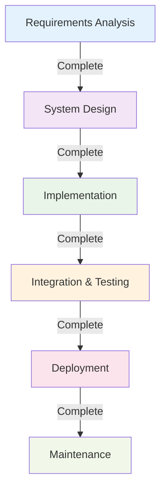
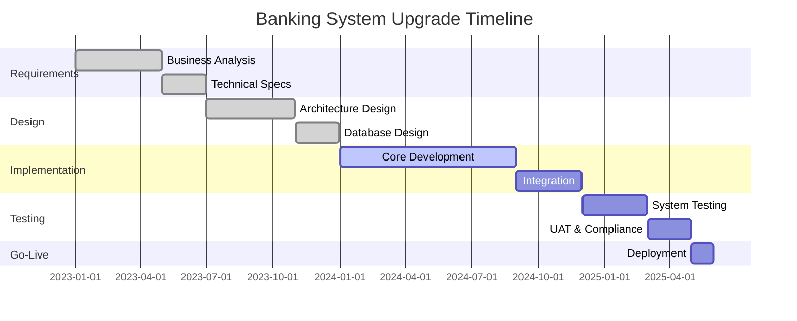

# Waterfall Model Deep Dive

**Tags:** #SDLC #Waterfall #Sequential #Traditional #PredictiveModel
**Last Reviewed:** February 2, 2026

---

## Overview

The **Waterfall Model** is the classic linear sequential software development approach where development progresses through distinct phases that flow downwards like a waterfall. Each phase must be completed fully before the next phase begins.

**Key Metaphor:** Like water flowing down a waterfall, development moves in one direction - forward and downward through each phase.

## Core Principles

### Sequential Phase Structure

| Phase | Primary Focus | Key Question |
|-------|---------------|-------------|
| **1. Requirements Analysis** | Gather and document all requirements | "What needs to be built?" |
| **2. System Design** | Create system and software architecture | "How will it be structured?" |
| **3. Implementation** | Code development and unit testing | "Build the solution" |
| **4. Integration & Testing** | System integration and validation | "Does it work correctly?" |
| **5. Deployment** | System delivery and installation | "Release to users" |
| **6. Maintenance** | Ongoing support and enhancements | "Keep it running and evolving" |

### Phase Completeness Rules

✅ **Must Complete:** Each phase has specific deliverables  
✅ **Formal Review:** Approval required before proceeding  
❌ **No Backtracking:** Generally no backward movement allowed  
✅ **Clear Criteria:** Defined entry and exit conditions

## Detailed Phase Analysis

### Phase 1: Requirements Analysis 📝
| Aspect | Details |
|--------|----------|
| **Activities** | Requirements gathering, feasibility analysis, validation, stakeholder interviews |
| **Key Deliverables** | Requirements specification document, use case diagrams, requirements traceability matrix |
| **Duration** | 15-20% of project timeline |
| **Critical Success Factors** | Complete stakeholder engagement, clear requirement definitions |

### Phase 2: System Design 🏢
| Aspect | Details |
|--------|----------|
| **Activities** | System architecture design, database design, interface design, component specification |
| **Key Deliverables** | System design document, database schema, interface specifications, design reviews |
| **Duration** | 15-20% of project timeline |
| **Critical Success Factors** | Scalable architecture, clear component boundaries |

### Phase 3: Implementation ⚙️
| Aspect | Details |
|--------|----------|
| **Activities** | Code development, unit testing, code reviews, documentation |
| **Key Deliverables** | Source code, unit test results, technical documentation, code review reports |
| **Duration** | 40-50% of project timeline |
| **Critical Success Factors** | Adherence to design specs, quality coding practices |
- Code reviews
- Component integration

**Deliverables:**
- Source code
- Unit test results
- Code documentation
- Build scripts

### 4. Integration and Testing
**Activities:**
- System integration
- Integration testing
- System testing
- User acceptance testing

### Phase 4: Integration & Testing 🔍
| Aspect | Details |
|--------|----------|
| **Activities** | System integration, integration testing, user acceptance testing, performance testing |
| **Key Deliverables** | Integrated system, test plans and results, bug reports, user acceptance sign-off |
| **Duration** | 15-25% of project timeline |
| **Critical Success Factors** | Comprehensive test coverage, early defect detection |

### Phase 5: Deployment 🚀
| Aspect | Details |
|--------|----------|
| **Activities** | Production deployment, user training, data migration, go-live support |
| **Key Deliverables** | Deployed system, user manuals, training materials, deployment documentation |
| **Duration** | 5-10% of project timeline |
| **Critical Success Factors** | Smooth transition, user adoption |

### Phase 6: Maintenance 🔧
| Aspect | Details |
|--------|----------|
| **Activities** | Bug fixes, performance optimization, feature enhancements, ongoing support |
| **Key Deliverables** | Updated system versions, maintenance reports, change documentation |
| **Duration** | Ongoing (years) |
| **Critical Success Factors** | Responsive support, controlled changes |

## Real-World Case Studies

### Case Study 1: NASA Mars Rover Software 🚀

**Why Waterfall Was Chosen:**
- Mission-critical system with zero tolerance for failure
- Well-understood requirements based on previous missions  
- Extensive regulatory and safety requirements
- Need for comprehensive documentation for review

**Project Timeline & Results:**

| Phase | Duration | Key Activities | Outcome |
|-------|----------|----------------|----------|
| **Requirements** | 8 months | Detailed mission specifications, safety requirements | 847-page requirements document |
| **Design** | 12 months | System architecture, hardware-software integration | Fault-tolerant design with 3x redundancy |
| **Implementation** | 18 months | Code development with extensive reviews | 2.5 million lines of tested code |
| **Testing** | 14 months | Extensive simulation, hardware-in-the-loop testing | 99.97% test coverage achieved |
| **Deployment** | 2 months | Launch preparation, final system validation | Successful Mars landing and operation |

**Success Factors:**
- Rigorous requirements management
- Extensive peer reviews at each phase
- Comprehensive testing strategy
- Clear documentation for future missions

### Case Study 2: Banking Core System Upgrade 🏦

**Project Context:**
- Regional bank upgrading 20-year-old core banking system
- 500,000+ customer accounts to migrate
- Regulatory compliance requirements (SOX, Basel III)
- 99.99% uptime requirement

**Waterfall Implementation:**

**Results:**
- **Budget:** $12M (on budget)
- **Timeline:** 18 months (2 months ahead of schedule)
- **Migration Success:** 99.8% of accounts migrated without issues
- **Compliance:** Passed all regulatory audits

### Case Study 3: Government Tax Processing System 🏢

**Project Challenges:**
- Fixed annual deadline (tax season)
- Complex regulatory requirements
- Integration with multiple state systems
- High transaction volume (millions of returns)

**Waterfall Success Elements:**

| Success Factor | Implementation | Result |
|----------------|----------------|--------|
| **Detailed Planning** | 6-month requirements phase with all stakeholders | Zero scope creep during development |
| **Risk Management** | Extensive testing with previous year's data | Smooth launch handling 3x expected volume |
| **Documentation** | Comprehensive operational procedures | 24/7 support team ready from day one |
| **Quality Gates** | Formal review at each phase gate | Defect rate 90% lower than previous system |

## When Waterfall Works Best

### Perfect Fit Scenarios ✅

| Industry/Project Type | Why Waterfall Succeeds | Example Projects |
|-----------------------|----------------------|------------------|
| **Safety-Critical Systems** | Rigorous testing, comprehensive docs | Medical devices, nuclear systems, aviation |
| **Regulated Industries** | Audit trails, compliance documentation | Banking, pharmaceuticals, government |
| **Well-Defined Requirements** | Stable scope, clear specifications | ERP implementations, system migrations |
| **Large-Scale Infrastructure** | Sequential dependencies, resource planning | Data center builds, network deployments |

### Warning Signs for Waterfall ⚠️

- Requirements are vague or likely to change
- Stakeholders haven't agreed on priorities
- Technology is new or unproven
- Time-to-market is critical
- Innovation is more important than predictability

## Practical Exercises

### Exercise 1: Waterfall Suitability Assessment 📋

**Scenario:** You're a systems analyst tasked with recommending an SDLC model for these projects.

**Rate each project for Waterfall suitability (1-Poor fit, 5-Perfect fit):**

| Project | Requirements Stability | Timeline Flexibility | Budget Constraints | Compliance Needs | Waterfall Score |
|---------|----------------------|-------------------|------------------|------------------|----------------|
| **Startup Mobile App** | Unclear, evolving | Very tight | Limited | Minimal | ___/5 |
| **Hospital Patient Records** | Well-defined | Fixed deadline | Adequate | HIPAA required | ___/5 |
| **E-commerce Website** | Market-driven changes | Competitive pressure | Moderate | PCI compliance | ___/5 |
| **Nuclear Plant Control** | Extremely detailed | Safety-driven | Substantial | Extensive | ___/5 |
| **University Course System** | Established processes | Academic calendar | Fixed budget | FERPA compliance | ___/5 |

**Answers:** Startup (2), Hospital (5), E-commerce (2), Nuclear (5), University (4)

### Exercise 2: Phase Planning Workshop 📏

**Project:** City Library Management System
**Timeline:** 12 months | **Budget:** $500K | **Team:** 8 people

**Your Task:** Create a detailed phase plan

| Phase | Duration | Team Allocation | Key Milestones | Risk Mitigation |
|-------|----------|----------------|----------------|------------------|
| **Requirements** | _____ months | _____ people | _______________ | _______________ |
| **Design** | _____ months | _____ people | _______________ | _______________ |
| **Implementation** | _____ months | _____ people | _______________ | _______________ |
| **Testing** | _____ months | _____ people | _______________ | _______________ |
| **Deployment** | _____ months | _____ people | _______________ | _______________ |

### Exercise 3: Requirements Change Scenario 🔄

**Situation:** You're 60% through the implementation phase of a Waterfall project when the client requests a major feature change.

**Analysis Framework:**

1. **Impact Assessment:**
   - Timeline impact: _______________
   - Budget impact: _______________
   - Resource impact: _______________
   - Quality impact: _______________

2. **Options Analysis:**
   - **Option A:** Implement change now
     - Pros: _______________
     - Cons: _______________
   - **Option B:** Defer to next release
     - Pros: _______________
     - Cons: _______________
   - **Option C:** Reduce scope elsewhere
     - Pros: _______________
     - Cons: _______________

3. **Recommendation:** _______________

### Exercise 4: Quality Gate Design ✅

**Task:** Design quality gates for a government contract management system

**For each phase, define:**
- Entry criteria (what must be complete to start)
- Exit criteria (what must be achieved to proceed)
- Review participants
- Go/No-go decision criteria

| Phase Gate | Entry Criteria | Exit Criteria | Review Team | Decision Criteria |
|------------|----------------|---------------|-------------|-------------------|
| **Requirements → Design** | _______________ | _______________ | _______________ | _______________ |
| **Design → Implementation** | _______________ | _______________ | _______________ | _______________ |
| **Implementation → Testing** | _______________ | _______________ | _______________ | _______________ |

### Exercise 5: Project Recovery Plan 🆘

**Crisis Scenario:** Your Waterfall project is in trouble:
- 3 months behind schedule
- 25% over budget  
- Key stakeholder is unhappy with progress
- Team morale is low
- Quality issues discovered

**Your Recovery Strategy:**

1. **Immediate Actions (Next 2 weeks):**
   - _______________________________
   - _______________________________
   - _______________________________

2. **Short-term Fixes (Next 2 months):**
   - _______________________________
   - _______________________________
   - _______________________________

3. **Long-term Improvements:**
   - _______________________________
   - _______________________________
   - _______________________________

### Self-Assessment Checklist 📋

**Rate your Waterfall knowledge (1-5 scale):**
- [ ] I can identify when Waterfall is the right choice
- [ ] I understand the risks and mitigation strategies
- [ ] I can plan and manage phase transitions effectively
- [ ] I know how to handle change requests in Waterfall
- [ ] I can design effective quality gates and reviews
- [ ] I'm ready to compare Waterfall with other SDLC models
- Risk assessment at each phase

### Quality Assurance
- Regular quality reviews
- Formal testing phases
- Configuration management
- Change control processes

### Risk Mitigation
- Prototyping for unclear requirements
- Regular stakeholder reviews
- Risk assessment and monitoring
- Contingency planning

## When to Use Waterfall

### Suitable Scenarios
- Well-understood requirements
- Stable technology stack
- Regulatory requirements
- Mission-critical systems
- Large development teams

### Project Characteristics
- Clear, detailed requirements
- Experienced team
- Fixed scope and budget
- Long-term planning possible
- Quality documentation essential

## Common Pitfalls

### Requirements Issues
- Incomplete requirements gathering
- Changing requirements handling
- Customer expectation management
- Requirements validation gaps

### Timeline Issues
- Unrealistic deadlines
- Underestimated complexity
- Resource availability problems
- Dependency management failures

## Modern Applications

### Modified Waterfall
- Iterative elements added
- Prototyping included
- Customer feedback loops
- Risk reduction measures

### Hybrid Models
- Waterfall with agile elements
- Scaled agile frameworks
- DevOps integration
- Continuous delivery practices

---

**Key Takeaway:** The Waterfall Model provides excellent structure and documentation but works best when requirements are well-understood and stable. Consider hybrid approaches for complex, changing environments.