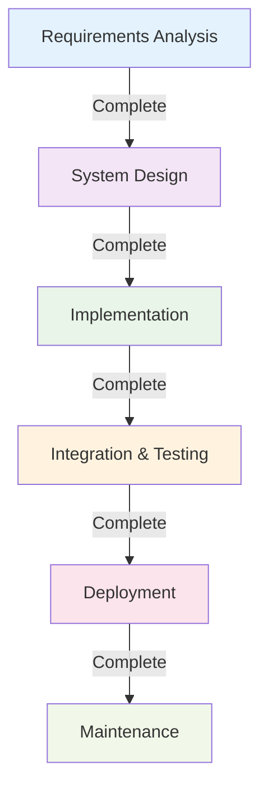

# Waterfall Model Deep Dive

**Tags:** #SDLC #Waterfall #Sequential #Traditional #PredictiveModel
**Last Reviewed:** February 2, 2026

---

## Overview

The **Waterfall Model** is the classic linear sequential software development approach where development progresses through distinct phases that flow downwards like a waterfall. Each phase must be completed fully before the next phase begins.

**Key Metaphor:** Like water flowing down a waterfall, development moves in one direction - forward and downward through each phase.

## Core Principles

### Sequential Phase Structure

| Phase | Primary Focus | Key Question |
|-------|---------------|-------------|
| **1. Requirements Analysis** | Gather and document all requirements | "What needs to be built?" |
| **2. System Design** | Create system and software architecture | "How will it be structured?" |
| **3. Implementation** | Code development and unit testing | "Build the solution" |
| **4. Integration & Testing** | System integration and validation | "Does it work correctly?" |
| **5. Deployment** | System delivery and installation | "Release to users" |
| **6. Maintenance** | Ongoing support and enhancements | "Keep it running and evolving" |

### Phase Completeness Rules

✅ **Must Complete:** Each phase has specific deliverables  
✅ **Formal Review:** Approval required before proceeding  
❌ **No Backtracking:** Generally no backward movement allowed  
✅ **Clear Criteria:** Defined entry and exit conditions

## Detailed Phase Analysis

### Phase 1: Requirements Analysis 📝
| Aspect | Details |
|--------|----------|
| **Activities** | Requirements gathering, feasibility analysis, validation, stakeholder interviews |
| **Key Deliverables** | Requirements specification document, use case diagrams, requirements traceability matrix |
| **Duration** | 15-20% of project timeline |
| **Critical Success Factors** | Complete stakeholder engagement, clear requirement definitions |

### Phase 2: System Design 🏢
| Aspect | Details |
|--------|----------|
| **Activities** | System architecture design, database design, interface design, component specification |
| **Key Deliverables** | System design document, database schema, interface specifications, design reviews |
| **Duration** | 15-20% of project timeline |
| **Critical Success Factors** | Scalable architecture, clear component boundaries |

### Phase 3: Implementation ⚙️
| Aspect | Details |
|--------|----------|
| **Activities** | Code development, unit testing, code reviews, documentation |
| **Key Deliverables** | Source code, unit test results, technical documentation, code review reports |
| **Duration** | 40-50% of project timeline |
| **Critical Success Factors** | Adherence to design specs, quality coding practices |
- Code reviews
- Component integration

**Deliverables:**
- Source code
- Unit test results
- Code documentation
- Build scripts

### 4. Integration and Testing
**Activities:**
- System integration
- Integration testing
- System testing
- User acceptance testing

### Phase 4: Integration & Testing 🔍
| Aspect | Details |
|--------|----------|
| **Activities** | System integration, integration testing, user acceptance testing, performance testing |
| **Key Deliverables** | Integrated system, test plans and results, bug reports, user acceptance sign-off |
| **Duration** | 15-25% of project timeline |
| **Critical Success Factors** | Comprehensive test coverage, early defect detection |

### Phase 5: Deployment 🚀
| Aspect | Details |
|--------|----------|
| **Activities** | Production deployment, user training, data migration, go-live support |
| **Key Deliverables** | Deployed system, user manuals, training materials, deployment documentation |
| **Duration** | 5-10% of project timeline |
| **Critical Success Factors** | Smooth transition, user adoption |

### Phase 6: Maintenance 🔧
| Aspect | Details |
|--------|----------|
| **Activities** | Bug fixes, performance optimization, feature enhancements, ongoing support |
| **Key Deliverables** | Updated system versions, maintenance reports, change documentation |
| **Duration** | Ongoing (years) |
| **Critical Success Factors** | Responsive support, controlled changes |

## Waterfall Model: Pros & Cons Analysis

| Advantages ✅ | Disadvantages ❌ |
|-------------|------------------|
| **Clear Structure:** Well-defined milestones and deliverables | **Inflexibility:** Difficult to accommodate changing requirements |
| **Predictable:** Easy progress tracking and timeline estimation | **Late Feedback:** Customer sees product only at the end |
| **Quality Documentation:** Comprehensive documentation for maintenance | **High Risk:** Issues discovered late are expensive to fix |
| **Management Control:** Easy resource planning and stakeholder communication | **Long Development:** Extended time before working software |
| **Regulatory Compliance:** Formal processes meet audit requirements | **Assumption-Heavy:** Based on upfront requirement completeness |

## Disadvantages

### Inflexibility
- Difficult to accommodate changes
- Late feedback integration
- High risk of requirement errors
- Long feedback cycles

### Risk Concentration
- Major issues discovered late
- Expensive defect correction
- Integration problems late in cycle
- Customer dissatisfaction risk

### Resource Utilization
- Team idle time between phases
- Sequential dependencies
- Limited parallel work
- Extended project timelines

## Best Practices

### Phase Management
- Clear phase entry/exit criteria
- Formal phase review meetings
- Stakeholder involvement
- Risk assessment at each phase

### Quality Assurance
- Regular quality reviews
- Formal testing phases
- Configuration management
- Change control processes

### Risk Mitigation
- Prototyping for unclear requirements
- Regular stakeholder reviews
- Risk assessment and monitoring
- Contingency planning

## When to Use Waterfall

### Suitable Scenarios
- Well-understood requirements
- Stable technology stack
- Regulatory requirements
- Mission-critical systems
- Large development teams

### Project Characteristics
- Clear, detailed requirements
- Experienced team
- Fixed scope and budget
- Long-term planning possible
- Quality documentation essential

## Common Pitfalls

### Requirements Issues
- Incomplete requirements gathering
- Changing requirements handling
- Customer expectation management
- Requirements validation gaps

### Timeline Issues
- Unrealistic deadlines
- Underestimated complexity
- Resource availability problems
- Dependency management failures

## Modern Applications

### Modified Waterfall
- Iterative elements added
- Prototyping included
- Customer feedback loops
- Risk reduction measures

### Hybrid Models
- Waterfall with agile elements
- Scaled agile frameworks
- DevOps integration
- Continuous delivery practices

---

**Key Takeaway:** The Waterfall Model provides excellent structure and documentation but works best when requirements are well-understood and stable. Consider hybrid approaches for complex, changing environments.