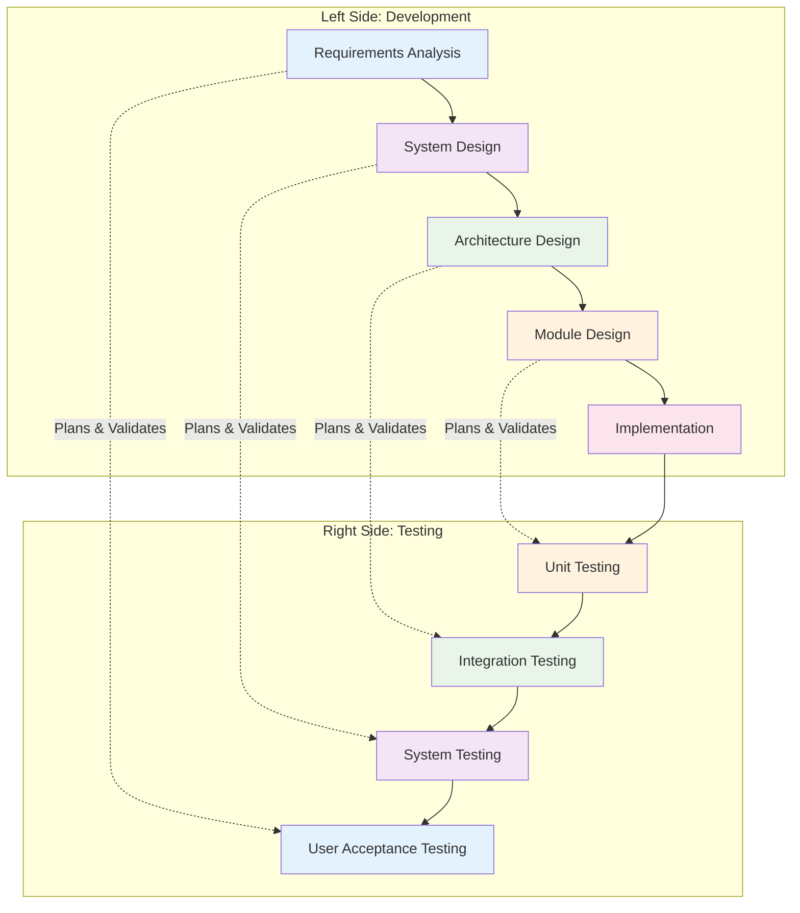

# V-Model (Verification & Validation Model)

**Tags:** #SDLC #VModel #Testing #Verification #Validation #QualityAssurance
**Last Reviewed:** February 2, 2026

---

## Overview

The **V-Model** (Verification and Validation Model) is an extension of the Waterfall Model that emphasizes **testing throughout the development lifecycle**. It creates a V-shaped diagram where each development phase has a corresponding testing phase, ensuring quality is built into every stage.

**Key Philosophy:** *"Quality cannot be tested in; it must be built in."*

## Core Concept

### V-Shaped Architecture

### Verification vs. Validation

| Aspect | Verification | Validation |
|--------|-------------|------------|
| **Question** | "Are we building the product right?" | "Are we building the right product?" |
| **Focus** | Process correctness | Product correctness |
| **When** | During development phases | At completion of phases |
| **Methods** | Reviews, inspections, walkthroughs | Testing, demonstrations, user feedback |
| **Goal** | Ensure compliance with specifications | Ensure user needs are met |

## Detailed Phases

### Left Side: Development Phases

#### 1. Requirements Analysis
- Business requirements gathering
- User requirements specification
- System requirements definition
- Acceptance criteria definition

#### 2. System Design
- High-level system architecture
- Component identification
- Interface specifications
- System-level test planning

#### 3. Architectural Design
- Detailed component design
- Data structures definition
- Interface design specifications
- Integration test planning

#### 4. Module Design
- Detailed module specifications
- Algorithm design
- Data flow specifications
- Unit test planning

### Right Side: Testing Phases

#### 1. Unit Testing
- Individual module testing
- Code coverage analysis
- Error handling verification
- Performance baseline testing

#### 2. Integration Testing
- Component integration testing
- Interface validation
- Data flow verification
- System cohesion testing

#### 3. System Testing
- End-to-end system validation
- Functional requirement verification
- Non-functional requirement testing
- System performance evaluation

#### 4. Acceptance Testing
- User acceptance testing
- Business requirement validation
- Operational readiness verification
- Final system approval

## Advantages

### Quality Focus
- Testing integrated throughout lifecycle
- Early defect detection
- Comprehensive test coverage
- Quality built into each phase

### Structured Approach
- Clear development path
- Defined deliverables
- Measurable progress
- Formal quality gates

### Risk Management
- Early testing planning
- Defect prevention focus
- Systematic validation
- Stakeholder confidence

## Disadvantages

### Rigidity
- Sequential nature limits flexibility
- Changes difficult to accommodate
- Long development cycles
- Customer feedback delayed

### Resource Intensive
- Extensive testing requirements
- Documentation overhead
- Multiple test phase management
- Higher cost structure

### Planning Intensive
- Detailed test planning required
- Comprehensive documentation
- Formal processes
- Extended timelines

## Testing Types in V-Model

### Unit Testing
- Tests individual components/modules
- Focuses on code correctness
- Developer responsibility
- Automated testing emphasis

### Integration Testing
- Tests component interactions
- Validates interfaces
- Data flow verification
- Incremental integration approaches

### System Testing
- Tests complete system functionality
- End-to-end validation
- Performance and reliability testing
- User environment simulation

### Acceptance Testing
- Validates business requirements
- User satisfaction verification
- Operational readiness confirmation
- Final acceptance criteria

## Best Practices

### Test Planning
- Test plans created with requirements
- Test cases designed early
- Test data preparation
- Test environment setup

### Quality Assurance
- Code review processes
- Static analysis tools
- Automated testing frameworks
- Continuous integration practices

### Documentation
- Test case documentation
- Test result recording
- Defect tracking
- Test coverage reporting

## When to Use V-Model

### Suitable Projects
- Safety-critical systems
- Regulatory compliance required
- High reliability requirements
- Complex system integration
- Mission-critical applications

### Industry Applications
- Aerospace and defense
- Medical device development
- Automotive systems
- Nuclear power systems
- Financial systems

## Common Challenges

### Test Management
- Test case maintenance
- Test environment management
- Test data management
- Test result analysis

### Timeline Issues
- Extended development cycles
- Resource allocation challenges
- Dependency management
- Milestone achievement

## Modern Adaptations

### V-Model XT
- Extended V-Model
- Risk-based testing
- Incremental delivery options
- Agile element integration

### V-Model with Agile
- Combining V-Model structure
- Agile development practices
- Continuous testing integration
- Flexible delivery approaches

---

**Key Takeaway:** The V-Model excels in projects requiring high quality and comprehensive testing, particularly in regulated industries where verification and validation are critical.