# Spiral Model (Risk-Driven Development)

**Tags:** #SDLC #SpiralModel #RiskManagement #Iterative #Prototyping #RiskDriven
**Last Reviewed:** February 2, 2026

---

## Overview

The **Spiral Model** combines elements of iterative development with systematic risk management. It emphasizes risk assessment and reduction through multiple iterations, making it ideal for large, complex projects where risk management is critical.

**Key Innovation:** *First SDLC model to make risk management the central organizing principle*

```mermaid
flowchart TD
    subgraph "Spiral Quadrants (Repeated Each Cycle)"
        A["① DETERMINE OBJECTIVES<br/>🎯 Define requirements<br/>📊 Set constraints<br/>📈 Identify alternatives"] --> B["② RISK ANALYSIS<br/>⚠️ Identify risks<br/>🔍 Analyze risks<br/>🚀 Create prototypes"]
        B --> C["③ DEVELOPMENT & TEST<br/>🔧 Build increment<br/>✅ Verify solution<br/>📝 Document results"]
        C --> D["④ PLAN NEXT ITERATION<br/>📋 Review progress<br/>🔄 Plan next cycle<br/>📅 Stakeholder approval"]
        D -.->|"Next Spiral"| A
    end
    
    E[Project Start] --> A
    D --> F[Release Decision]
    
    style A fill:#e3f2fd
    style B fill:#ffebee
    style C fill:#e8f5e8
    style D fill:#fff3e0
```

## Core Principles & Risk-Driven Philosophy

### The Risk-First Approach

| Principle | Description | How It Works | Benefit |
|-----------|-------------|-------------|----------|
| **Risk-Driven** | Highest-risk elements addressed first | Each cycle tackles biggest risks | Early problem identification |
| **Incremental** | System built in increments | Working software each cycle | Continuous stakeholder feedback |
| **Prototype-Heavy** | Prototypes resolve uncertainties | Risk reduction through experimentation | Validated solutions |
| **Stakeholder Involvement** | Customer participation each cycle | Regular reviews and approvals | Aligned expectations |

### Four-Quadrant Cycle Structure

#### Quadrant I: Determine Objectives 🎯
**Primary Activities:**
- Define requirements and constraints for this cycle
- Identify alternative solutions
- Set success criteria and acceptance conditions

**Key Deliverables:** Requirements document, constraints list, success criteria

#### Quadrant II: Risk Analysis ⚠️
**Primary Activities:**
- Identify potential risks and uncertainties
- Assess risk probability and impact
- Develop risk mitigation strategies through prototyping

**Key Deliverables:** Risk analysis report, prototypes, risk mitigation plan

#### Quadrant III: Development & Testing 🔧
**Primary Activities:**
- Develop the planned increment
- Conduct integration and testing
- Validate solutions against requirements

**Key Deliverables:** Working software increment, test results, documentation

#### Quadrant IV: Plan Next Iteration 📋
**Primary Activities:**
- Review cycle results with stakeholders
- Plan objectives for next spiral
- Decide whether to continue, modify, or terminate

**Key Deliverables:** Cycle review report, next iteration plan, go/no-go decision

## Spiral Structure

### Cycle 1: Proof of Concept
**Objectives:** Basic feasibility and requirements
**Risks:** Technology, requirements, concept
**Development:** Core functionality prototype
**Planning:** Detailed requirements and design

### Cycle 2: Core System
**Objectives:** System architecture and core functionality
**Risks:** Design, integration, performance
**Development:** Architectural prototype
**Planning:** System design and implementation

### Cycle 3: System Refinement
**Objectives:** Complete system with refinements
**Risks:** Interface, usability, scalability
**Development:** Working system prototype
**Planning:** Testing and deployment

### Cycle 4+: Enhancement Cycles
**Objectives:** Additional features and optimizations
**Risks:** Performance, reliability, maintenance
**Development:** Production system
**Planning:** Maintenance and enhancement

## Advantages

### Risk Management
- Systematic risk identification
- Risk mitigation focus
- Early problem detection
- Risk reduction through prototyping

### Flexibility
- Accommodates changing requirements
- Iterative refinement possible
- User feedback integration
- Progressive system development

### Quality Focus
- Multiple validation points
- Comprehensive testing
- Stakeholder involvement
- Quality built into process

## Disadvantages

### Complexity
- Complex model management
- Resource intensive
- Requires experienced team
- Documentation overhead

### Cost and Time
- Higher development costs
- Extended timelines
- Multiple iterations
- Resource allocation challenges

### Management Challenges
- Spiral control difficult
- Progress measurement hard
- Stakeholder management
- Decision point complexity

## Risk Analysis Process

### 1. Risk Identification
- Technical risks
- Management risks
- Business risks
- External risks

### 2. Risk Analysis
- Probability assessment
- Impact evaluation
- Risk prioritization
- Mitigation strategy development

### 3. Risk Mitigation
- Prototyping
- Simulation
- Benchmarking
- Alternative evaluation

### 4. Risk Monitoring
- Risk tracking
- Status monitoring
- Contingency planning
- Risk reassessment

## Best Practices

### Risk Management
- Comprehensive risk database
- Regular risk reviews
- Mitigation strategy execution
- Risk monitoring processes

### Prototyping
- Appropriate prototype selection
- Prototype evaluation criteria
- User feedback collection
- Prototype integration planning

### Stakeholder Management
- Regular stakeholder reviews
- Communication planning
- Expectation management
- Decision documentation

## When to Use Spiral Model

### Suitable Projects
- Large, complex systems
- High-risk projects
- New technology adoption
- Uncertain requirements
- Mission-critical systems

### Industry Applications
- Defense systems
- Aerospace projects
- Large enterprise systems
- Research and development
- High-risk software projects

## Common Challenges

### Spiral Management
- Maintaining spiral momentum
- Decision point management
- Resource allocation
- Timeline control

### Risk Assessment
- Risk identification completeness
- Risk probability accuracy
- Impact assessment
- Mitigation effectiveness

## Success Factors

### Team Expertise
- Risk management experience
- Technical expertise
- Domain knowledge
- Project management skills

### Organizational Support
- Management commitment
- Resource availability
- Stakeholder support
- Quality focus

### Process Maturity
- Defined processes
- Measurement systems
- Continuous improvement
- Knowledge management

---

**Key Takeaway:** The Spiral Model excels in high-risk, complex projects where systematic risk management and iterative development are essential. Success requires experienced teams and strong risk management processes.