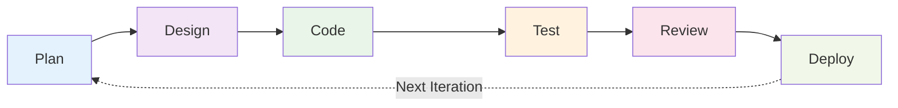
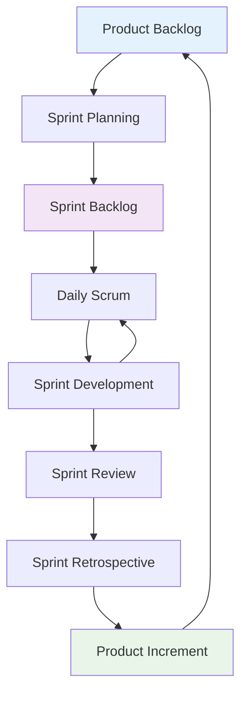

# Agile Methodology

**Tags:** #SDLC #Agile #Iterative #Flexible #Scrum #CustomerCollaboration
**Last Reviewed:** February 2, 2026

---

## Overview

**Agile Methodology** is an iterative and incremental approach to software development that emphasizes **flexibility, collaboration, and customer satisfaction**. It focuses on delivering working software frequently and responding effectively to changing requirements.

**Core Philosophy:** *"Embrace change, deliver value early and often, prioritize people over processes."*

## The Agile Manifesto: Core Values

| Agile Values | Traditional Emphasis | Agile Emphasis | Impact |
|--------------|---------------------|----------------|--------|
| **Individuals & Interactions** | ← Processes and Tools | People and communication valued over rigid processes | Enhanced team collaboration, faster problem-solving |
| **Working Software** | ← Comprehensive Documentation | Functional software prioritized over extensive docs | Faster value delivery, customer satisfaction |
| **Customer Collaboration** | ← Contract Negotiation | Active customer involvement throughout development | Better requirement understanding, reduced rework |
| **Responding to Change** | ← Following a Plan | Embracing changing requirements as competitive advantage | Market adaptability, innovation enablement |

### Key Mindset Shifts

🔄 **From** "Plan everything upfront" ➡️ **To** "Plan as you learn"  
🔄 **From** "Document everything" ➡️ **To** "Document what adds value"  
🔄 **From** "Follow the contract" ➡️ **To** "Collaborate for success"  
🔄 **From** "Stick to the plan" ➡️ **To** "Adapt to reality"

## Agile Frameworks Comparison

| Framework | Best For | Key Strength | Team Size | Iteration Length |
|-----------|----------|--------------|-----------|------------------|
| **Scrum** | Cross-functional teams | Structured ceremonies | 5-9 people | 2-4 weeks |
| **Kanban** | Support/maintenance teams | Visual workflow | Any size | Continuous |
| **XP** | Software development | Technical practices | 2-10 people | 1-2 weeks |
| **SAFe** | Large enterprises | Scaling coordination | 50+ people | 8-12 weeks |
| **Crystal** | Small, co-located teams | Simplicity | 2-8 people | Flexible |

### Scrum Deep Dive 🏉

**The Scrum Framework in Action:**

**Scrum Roles & Responsibilities:**

| Role | Primary Responsibility | Key Activities |
|------|----------------------|----------------|
| **Product Owner** | Maximize product value | Backlog management, stakeholder communication, acceptance criteria |
| **Scrum Master** | Facilitate Scrum process | Remove impediments, coach team, protect team from distractions |
| **Development Team** | Deliver working software | Design, code, test, collaborate, self-organize |

### Kanban Workflow Management 📋

**Sample Kanban Board for Support Team:**

| Backlog | In Progress | Code Review | Testing | Done |
|---------|-------------|-------------|---------|------|
| Bug #1234 | Feature ABC | Bug #5678 | Feature XYZ | Bug #9999 |
| Feature DEF | (WIP: 3/3) | (WIP: 2/2) | (WIP: 1/2) | Feature GHI |
| Enhancement | | | | Bug #1111 |

**WIP Limits Benefits:**
- Forces focus on completion
- Identifies bottlenecks quickly
- Improves flow efficiency
- Reduces context switching

## Development Process

### 1. Project Initiation
- Vision and scope definition
- Initial backlog creation
- Team formation
- Environment setup

### 2. Iteration Planning
- Sprint/backlog item selection
- Task breakdown and estimation
- Commitment and capacity planning
- Sprint goal definition

### 3. Development Cycle
- Daily collaboration and coordination
- Continuous integration and testing
- Regular customer feedback
- Adaptive planning and adjustment

### 4. Delivery and Review
- Working software demonstration
- Customer feedback collection
- Retrospective and improvement
- Next iteration planning

## Advantages

### Flexibility and Adaptability
- Responds to changing requirements
- Customer feedback integration
- Market condition adaptation
- Competitive advantage

### Quality and Speed
- Frequent delivery of working software
- Continuous testing and integration
- Early defect detection
- Rapid response to issues

### Team and Customer Satisfaction
- Collaborative work environment
- Customer involvement and satisfaction
- Motivated and empowered teams
- Transparency and visibility

## Disadvantages

### Management Challenges
- Less predictability in planning
- Scope creep potential
- Resource allocation difficulties
- Progress measurement challenges

### Team Requirements
- Self-organizing team skills required
- Strong communication abilities
- Technical excellence needed
- Customer availability essential

### Documentation Concerns
- Minimal documentation approach
- Knowledge transfer challenges
- Compliance and audit difficulties
- Long-term maintenance issues

## Best Practices

### Team Practices
- Cross-functional team composition
- Daily stand-up meetings
- Pair programming and code reviews
- Continuous learning and improvement

### Process Practices
- User story creation and refinement
- Sprint planning and retrospectives
- Burndown chart monitoring
- Velocity tracking and improvement

### Quality Practices
- Test-driven development
- Continuous integration
- Automated testing
- Code quality standards

## When to Use Agile

### Suitable Projects
- Dynamic requirements environments
- Innovative or exploratory projects
- Customer collaboration possible
- Small to medium-sized teams
- Fast-moving market conditions

### Project Characteristics
- Uncertain or changing requirements
- Customer available for feedback
- Team experienced in agile practices
- Short delivery cycles desired
- Innovation and experimentation needed

## Scaling Agile

### Scrum of Scrums
- Coordination between multiple Scrum teams
- Daily Scrum of Scrums meetings
- Integration and dependency management
- Cross-team communication

### Large-Scale Scrum (LeSS)
- Scaling Scrum to large organizations
- Multiple teams working on same product
- Shared product backlog
- Cross-team coordination

### Scaled Agile Framework (SAFe)
- Comprehensive scaling framework
- Multiple levels of planning
- Program and portfolio management
- Enterprise-level coordination

## Common Challenges

### Adoption Issues
- Organizational culture resistance
- Management mindset shift
- Process discipline requirements
- Training and coaching needs

### Scaling Problems
- Coordination complexity
- Communication overhead
- Integration challenges
- Consistency maintenance

## Success Factors

### Organizational Factors
- Leadership support and commitment
- Cultural readiness for change
- Resource availability
- Training investment

### Team Factors
- Self-organizing capabilities
- Technical competence
- Collaboration skills
- Continuous improvement focus

### Process Factors
- Discipline in agile practices
- Regular retrospectives
- Measurement and adaptation
- Customer partnership

---

**Key Takeaway:** Agile Methodology prioritizes working software, customer collaboration, and adaptability. Success depends on experienced teams, strong communication, and organizational commitment to agile principles.