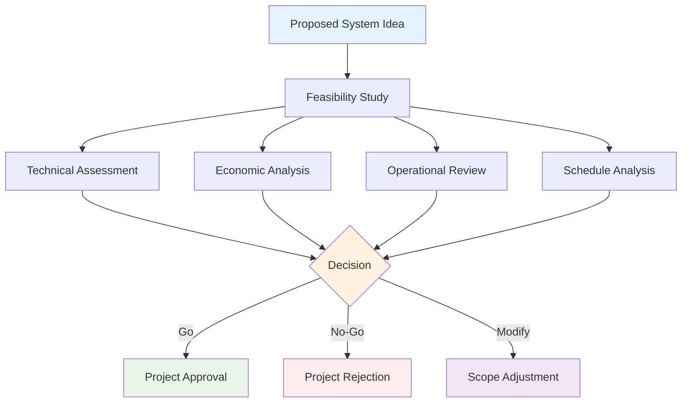
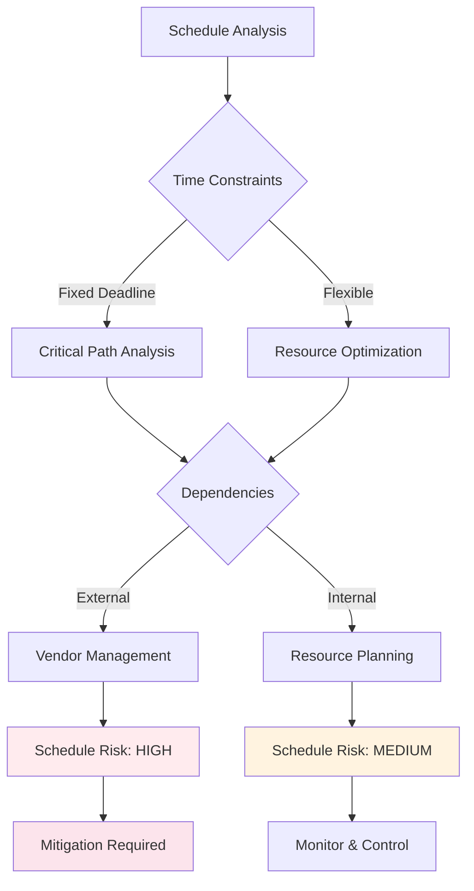

# Feasibility Study

**Tags:** #ProjectInitiation #FeasibilityStudy #CostBenefit #TechnicalFeasibility #ROI
**Last Reviewed:** February 2, 2026

---

## Overview

A **feasibility study** is a comprehensive analysis conducted before starting a project to determine whether the proposed system is **viable and worth pursuing**. It systematically evaluates technical, economic, operational, and organizational aspects to inform go/no-go decisions.

**Key Question:** *"Should we build this system, and can we succeed if we try?"*

## Four Dimensions of Feasibility Analysis

| Feasibility Type | Key Question | Assessment Areas | Success Criteria |
|-----------------|-------------|------------------|------------------|
| **Technical** | "Can we build it with available technology?" | Technology assessment, resource requirements, team expertise, integration possibilities | Available skills, proven technology, realistic timeline |
| **Economic** | "Will it provide sufficient financial value?" | Development costs, operational costs, benefits, ROI, break-even analysis | Positive ROI, manageable costs, clear benefits |
| **Operational** | "Will it work in our business environment?" | Business process impact, user acceptance, organizational culture, workflow integration | User buy-in, minimal disruption, cultural fit |
| **Schedule** | "Can we deliver it on time?" | Timeline constraints, resource availability, dependencies, market windows | Realistic milestones, available resources, competitive timing |

### Detailed Feasibility Breakdown

#### Technical Feasibility 🔧

**Core Evaluation Areas:**

| Factor | Assessment Questions | Risk Level | Mitigation Strategies |
|--------|---------------------|-----------|----------------------|
| **Technology Stack** | Is the required technology mature and proven? | Low-High | Proof of concepts, pilot projects |
| **Team Expertise** | Do we have the necessary skills in-house? | Medium | Training plans, external consultants |
| **Integration Complexity** | How will it connect with existing systems? | Medium-High | API analysis, integration testing |
| **Infrastructure Requirements** | What hardware/network upgrades are needed? | Low-Medium | Capacity planning, cloud options |

#### Economic Feasibility 💰

**Cost-Benefit Analysis Framework:**

| Cost Category | Typical Range | Benefit Category | Measurement Method |
|---------------|---------------|------------------|-------------------|
| **Development** | 40-60% of total | **Cost Savings** | Process efficiency gains |
| **Infrastructure** | 20-30% of total | **Revenue Generation** | New business opportunities |
| **Training** | 5-10% of total | **Quality Improvements** | Error reduction, compliance |
| **Maintenance** | 15-25% annually | **Strategic Value** | Market positioning, competitiveness |
- **Training Requirements:** User training and support needs

### Legal & Compliance Feasibility ⚖️

**Compliance Assessment Matrix:**

| Compliance Area | Risk Level | Requirements | Timeline Impact | Cost Impact |
|----------------|-----------|-------------|----------------|-------------|
| **Regulatory Compliance** | High | Industry-specific regulations (FDA, SOX, GDPR) | 3-6 months | 15-25% of budget |
| **Intellectual Property** | Medium | Patent research, licensing agreements | 1-3 months | 5-15% of budget |
| **Data Privacy** | High | HIPAA, GDPR, state privacy laws | 2-4 months | 10-20% of budget |
| **Contractual Obligations** | Medium | Existing agreements, vendor contracts | 1-2 months | 5-10% of budget |

### Schedule Feasibility 🗺️

**Timeline Risk Assessment:**

**Critical Success Factors:**
- **Resource Availability:** Dedicated team members when needed
- **External Dependencies:** Third-party deliverables and approvals
- **Milestone Realism:** Achievable deadlines with buffer time
- **Risk Buffers:** 15-25% schedule contingency for unknowns

## Feasibility Study Process

### 1. Project Definition
**Activities:**
- Project scope definition
- Objective clarification
- Stakeholder identification
- Initial requirement gathering

**Deliverables:**
- Project charter
- Initial scope document
- Stakeholder list
- High-level objectives

### 2. Market/Technical Analysis
**Activities:**
- Market research and analysis
- Technology evaluation
- Competitive analysis
- Technical requirement assessment

**Deliverables:**
- Market analysis report
- Technology assessment
- Competitive analysis
- Technical requirements

### 3. Financial Analysis
**Activities:**
- Cost estimation
- Benefit identification
- Financial modeling
- Risk assessment

**Deliverables:**
- Cost-benefit analysis
- Financial projections
- Risk assessment
- ROI calculations

### 4. Operational Analysis
**Activities:**
- Current process analysis
- Future state modeling
- Impact assessment
- Change management planning

**Deliverables:**
- Operational impact analysis
- Change management plan
- Training requirements
- Implementation roadmap

### 5. Recommendation and Report
**Activities:**
- Alternative evaluation
- Recommendation formulation
- Risk mitigation planning
- Implementation planning

**Deliverables:**
- Feasibility report
- Recommendation document
- Risk mitigation plan
- Implementation strategy

## Cost-Benefit Analysis Methods

### Net Present Value (NPV)
- **Formula:** NPV = Σ (Benefits - Costs) / (1 + r)^t
- **Decision Rule:** Positive NPV indicates viable project
- **Time Value:** Accounts for time value of money
- **Risk Adjustment:** Incorporates risk factors

### Return on Investment (ROI)
- **Formula:** ROI = (Net Benefits / Total Costs) × 100
- **Break-even Point:** When cumulative benefits equal costs
- **Payback Period:** Time to recover initial investment
- **Internal Rate of Return (IRR):** Discount rate where NPV = 0

### Cost Categories
- **Direct Costs:** Hardware, software, personnel
- **Indirect Costs:** Training, downtime, overhead
- **Intangible Benefits:** Improved customer satisfaction, competitive advantage
- **Risk Costs:** Contingency planning and mitigation

## Risk Assessment

### Risk Identification
- **Technical Risks:** Technology obsolescence, integration issues
- **Financial Risks:** Cost overruns, budget constraints
- **Operational Risks:** User resistance, process changes
- **External Risks:** Market changes, regulatory changes

### Risk Analysis
- **Probability Assessment:** Likelihood of risk occurrence
- **Impact Evaluation:** Potential consequences
- **Risk Prioritization:** High, medium, low classification
- **Mitigation Strategies:** Prevention and contingency plans

## Feasibility Report Structure

### Executive Summary
- Project overview and objectives
- Key findings and recommendations
- Financial summary
- Go/no-go decision

### Methodology
- Study approach and scope
- Data collection methods
- Analysis techniques
- Assumptions and limitations

### Findings
- Technical feasibility assessment
- Economic analysis results
- Operational feasibility evaluation
- Risk assessment summary

### Recommendations
- Project viability conclusion
- Implementation recommendations
- Alternative options
- Next steps

## Best Practices

### Study Planning
- Clear scope definition
- Stakeholder involvement
- Expert consultation
- Comprehensive data collection

### Analysis Rigor
- Multiple analysis methods
- Sensitivity analysis
- Conservative assumptions
- Peer review process

### Communication
- Regular stakeholder updates
- Clear presentation of findings
- Actionable recommendations
- Risk transparency

## Common Pitfalls

### Analysis Errors
- Overly optimistic assumptions
- Incomplete cost identification
- Benefit overestimation
- Risk underestimation

### Scope Issues
- Too narrow analysis scope
- Missing stakeholder perspectives
- Inadequate data collection
- Time constraint pressures

## Success Factors

### Team Expertise
- Cross-functional team composition
- Technical and business expertise
- Analytical skills
- Communication abilities

### Organizational Support
- Management commitment
- Resource availability
- Data access
- Stakeholder cooperation

### Process Discipline
- Structured methodology
- Documentation standards
- Quality assurance
- Timeline management

---

**Key Takeaway:** A thorough feasibility study provides critical information for informed decision-making, reducing project risk and ensuring resources are invested in viable initiatives.