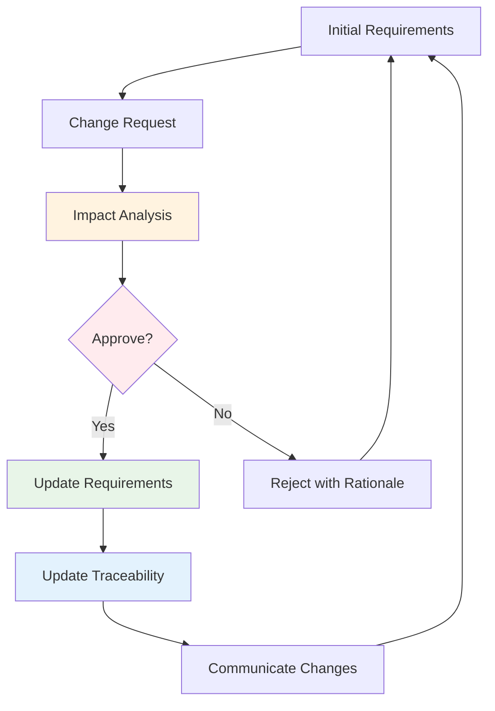

# Requirements Engineering Fundamentals

**Tags:** #RequirementsEngineering #Fundamentals #Elicitation #Analysis #Specification
**Last Reviewed:** February 2, 2026

---

## Overview

**Requirements Engineering** is the disciplined process of discovering, documenting, and maintaining requirements for a software system. It serves as the critical bridge between user needs and system implementation, ensuring the final product meets stakeholder expectations.

**Core Purpose:** Transform vague business problems into precise, implementable system specifications.

## Requirements Engineering Process

### Process Overview

| Phase | Primary Goal | Key Activities | Typical Duration |
|-------|-------------|----------------|------------------|
| **1. Elicitation** | Discover requirements | Stakeholder interviews, workshops, observation | 25-35% |
| **2. Analysis** | Understand and organize | Classification, prioritization, conflict resolution | 20-30% |
| **3. Specification** | Document precisely | Write formal specifications, create models | 20-25% |
| **4. Validation** | Verify correctness | Reviews, prototyping, user acceptance | 15-20% |
| **5. Management** | Control changes | Version control, traceability, change requests | Ongoing |

### 1. Requirements Elicitation 🗣️

**Primary Goal:** *"Discover what stakeholders really need"*

| Activity Type | Techniques | When to Use | Pros & Cons |
|---------------|------------|-------------|-------------|
| **Direct Communication** | Interviews, questionnaires, surveys | Clear stakeholders identified | ✅ Deep insights ❌ Time-intensive |
### 2. Requirements Analysis & Specification 🔍

**Primary Goal:** *"Transform raw requirements into structured, actionable specifications"*

| Activity | Techniques | Deliverables | Quality Criteria |
|----------|-----------|-------------|------------------|
| **Classification** | Functional vs non-functional, priority assignment | Categorized requirements matrix | Complete coverage, clear categories |
| **Prioritization** | MoSCoW, Kano model, cost-benefit analysis | Prioritized backlog | Stakeholder agreement, business value focus |
| **Conflict Resolution** | Negotiation, trade-off analysis, stakeholder workshops | Resolved requirements list | No contradictions, feasible scope |
| **Specification Writing** | Structured templates, acceptance criteria | Requirements specification document | Testable, unambiguous, complete |

### 3. Requirements Validation & Verification ✅

**Validation:** "Are we specifying the right requirements?"  
**Verification:** "Are the requirements specified correctly?"

| Validation Techniques | When to Use | Effectiveness | Resource Impact |
|----------------------|-------------|---------------|------------------|
| **Requirements Reviews** | All projects | High | Low |
| **Prototyping** | UI-heavy, unclear concepts | Very High | Medium-High |
| **User Story Walkthroughs** | Agile projects | High | Low-Medium |
| **Acceptance Test Creation** | All projects | High | Medium |
| **Model Validation** | Complex systems | Medium-High | High |

### 4. Requirements Management 🔄

**Lifecycle Activities:**

## Real-World Case Study: Hospital Management System

### Project Context
**Challenge:** Regional hospital needs integrated patient management system  
**Stakeholders:** Doctors, nurses, patients, administrators, IT staff, insurance companies  
**Timeline:** 18 months | **Budget:** $2.5M | **Compliance:** HIPAA, state regulations

### Requirements Elicitation Journey

#### Phase 1: Stakeholder Analysis (Month 1)

| Stakeholder Group | Primary Interests | Influence Level | Engagement Strategy |
|-------------------|-------------------|-----------------|--------------------|
| **Doctors** | Efficient patient data access, mobile compatibility | High | Individual interviews, workflow shadowing |
| **Nurses** | Easy data entry, medication tracking | High | Focus groups, current system analysis |
| **Patients** | Privacy, appointment scheduling, portal access | Medium | Surveys, patient advisory board |
| **Administration** | Cost control, reporting, compliance | High | Executive workshops, regulatory review |
| **Insurance** | Claims processing, data exchange | Medium | Industry standards review |

#### Phase 2: Requirements Discovery (Months 2-4)

**Technique Mix Used:**

| Week | Primary Technique | Focus Area | Key Discoveries |
|------|------------------|-----------|------------------|
| **Week 1-2** | Workflow Observation | Emergency dept, patient admissions | Current process takes 45 min, 12 forms |
| **Week 3-4** | Doctor Interviews | Patient history access, diagnostic tools | Need 3-second response time, integration with lab systems |
| **Week 5-6** | Nurse Focus Groups | Medication administration, shift changes | Barcode scanning essential, mobile cart compatibility |
| **Week 7-8** | Patient Surveys | Portal preferences, communication needs | 78% want online appointment scheduling |
| **Week 9-10** | Admin Workshops | Reporting requirements, compliance | 47 different reports needed, real-time dashboard |
| **Week 11-12** | Technical Assessment | Integration points, data migration | Legacy system has 15 years of data, 23 external interfaces |

### Requirements Analysis Results

**Requirements Breakdown:**

| Category | Count | Priority Distribution | Complexity Assessment |
|----------|-------|---------------------|----------------------|
| **Functional** | 247 | Must: 89, Should: 96, Could: 62 | High: 34, Medium: 156, Low: 57 |
| **Non-Functional** | 73 | Must: 41, Should: 25, Could: 7 | High: 23, Medium: 31, Low: 19 |
| **Interface** | 45 | Must: 28, Should: 12, Could: 5 | High: 18, Medium: 19, Low: 8 |
| **Data** | 89 | Must: 67, Should: 18, Could: 4 | High: 29, Medium: 41, Low: 19 |

### Sample Requirements with Quality Assessment

| Requirement ID | Description | Quality Issues | Improved Version |
|----------------|-------------|----------------|------------------|
| **REQ-001** | "System should be fast" | Vague, not testable | "System shall respond to patient lookup queries within 3 seconds for 95% of requests" |
| **REQ-045** | "Doctors need patient info" | Incomplete scope | "System shall display patient medical history, current medications, and allergies within 2 clicks from patient selection" |
| **REQ-078** | "Must be HIPAA compliant" | Too broad | "System shall implement role-based access controls, audit trails, and data encryption per HIPAA Security Rule requirements" |
- Updated requirements documents
- Impact analysis reports
- Requirements status reports

## Requirements Types

### Functional Requirements
- **Definition:** What the system must do
- **Characteristics:** Actions, processes, data transformations
- **Examples:** User authentication, data processing, report generation
- **Specification:** Use cases, functional specifications

### Non-Functional Requirements
- **Definition:** How well the system performs its functions
- **Categories:** Performance, security, usability, reliability, maintainability
- **Examples:** Response time, data security, user interface standards
- **Specification:** Quality attributes, constraints, standards

### Business Requirements
- **Definition:** High-level business objectives
- **Characteristics:** Business goals, success criteria, business rules
- **Examples:** Increase sales by 20%, reduce processing time
- **Specification:** Business case, success metrics

### User Requirements
- **Definition:** User-specific needs and expectations
- **Characteristics:** User goals, tasks, preferences
- **Examples:** Easy navigation, intuitive interface, quick access
- **Specification:** User stories, personas, scenarios

### System Requirements
- **Definition:** Detailed system capabilities and constraints
- **Characteristics:** Technical specifications, interfaces, data requirements
- **Examples:** Database capacity, API specifications, hardware requirements
- **Specification:** System architecture, interface specifications

## Requirements Quality Criteria

### Completeness
- **Coverage:** All required functionality specified
- **Consistency:** No conflicting requirements
- **Traceability:** Requirements linked to sources and rationale
- **Feasibility:** Technically and economically achievable

### Correctness
- **Accuracy:** Requirements accurately reflect needs
- **Validity:** Requirements verifiable and testable
- **Consistency:** Requirements don't contradict each other
- **Realism:** Requirements achievable within constraints

### Clarity and Precision
- **Unambiguous:** Single interpretation possible
- **Concise:** No unnecessary information
- **Understandable:** Clear to all stakeholders
- **Precise:** Exact meaning without vagueness

### Modifiability
- **Structured:** Easy to modify and update
- **Traceable:** Changes tracked and documented
- **Versioned:** Change history maintained
- **Impact Analysis:** Change effects assessable

## Requirements Documentation

### Requirements Specification Document
- **Introduction:** Purpose, scope, definitions
- **Overall Description:** Product perspective, user characteristics
- **Specific Requirements:** External interface, functional, non-functional
- **Appendices:** Analysis models, traceability matrices

### Use Case Specifications
- **Use Case Name:** Clear, descriptive identifier
- **Actors:** System users and external systems
- **Preconditions:** Required system state
- **Main Flow:** Primary success scenario
- **Alternative Flows:** Exception and variation scenarios
- **Postconditions:** System state after execution

### Requirements Traceability Matrix
- **Requirement ID:** Unique requirement identifier
- **Description:** Requirement summary
- **Source:** Origin of requirement
- **Priority:** Business importance
- **Status:** Current implementation status
- **Test Case:** Associated test cases

## Requirements Engineering Challenges

### Communication Issues
- **Stakeholder Diversity:** Different backgrounds and perspectives
- **Terminology Problems:** Different meanings for same terms
- **Requirement Ambiguity:** Vague or incomplete specifications
- **Changing Requirements:** Evolving user needs and business conditions

### Technical Challenges
- **Complexity Management:** Large system requirement handling
- **Dependency Management:** Interrelated requirement coordination
- **Scalability Issues:** Growing requirement set management
- **Integration Problems:** Multiple source requirement consolidation

### Organizational Issues
- **Stakeholder Availability:** Limited access to key stakeholders
- **Political Issues:** Conflicting stakeholder interests
- **Resource Constraints:** Limited time and budget
- **Change Resistance:** Resistance to new processes

## Best Practices

### Process Management
- **Structured Approach:** Defined requirements engineering process
- **Tool Support:** Requirements management tools
- **Review Processes:** Regular requirement reviews
- **Quality Assurance:** Requirement quality verification

### Stakeholder Management
- **Stakeholder Analysis:** Identify and categorize stakeholders
- **Communication Planning:** Regular stakeholder communication
- **Expectation Management:** Clear requirement commitment
- **Conflict Resolution:** Structured dispute resolution

### Quality Assurance
- **Review Techniques:** Formal and informal reviews
- **Validation Methods:** Prototyping and testing
- **Quality Metrics:** Requirement quality measurement
- **Continuous Improvement:** Process refinement

## Tools and Techniques

### Requirements Management Tools
- **IBM DOORS:** Advanced requirements management
- **Jira:** Agile requirement tracking
- **Confluence:** Collaborative documentation
- **ReqIF:** Requirements interchange format

### Modeling Tools
- **UML Tools:** Use case and class diagrams
- **BPMN Tools:** Business process modeling
- **Prototyping Tools:** Wireframing and mockup tools
- **Simulation Tools:** Requirement validation

### Analysis Techniques
- **Root Cause Analysis:** Problem origin identification
- **Gap Analysis:** Current vs desired state comparison
- **Impact Analysis:** Change effect assessment
- **Risk Analysis:** Requirement risk evaluation

---

**Key Takeaway:** Effective requirements engineering requires systematic processes, clear communication, and quality assurance to ensure the final system meets stakeholder needs and business objectives.