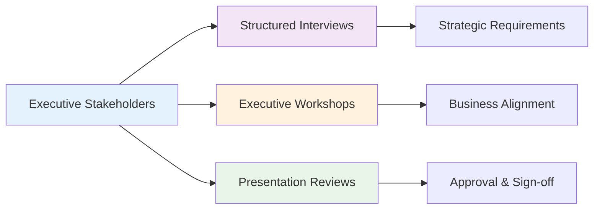

# Requirements Elicitation Techniques Guide

**Tags:** #RequirementsEngineering #Elicitation #Techniques #Stakeholders #BestPractices
**Last Reviewed:** February 2, 2026

---

## Overview

This comprehensive guide provides a systematic approach to choosing and applying requirements elicitation techniques based on project context, stakeholder characteristics, and information needs.

**Core Principle:** *"The right technique, with the right people, at the right time, yields the right requirements."*

## Complete Elicitation Techniques Matrix

### Technique Effectiveness by Situation

| Technique | Best For | Stakeholder Type | Information Type | Effort Level | Success Rate |
|-----------|----------|------------------|------------------|-------------|-------------|
| **Interviews** | Deep understanding, sensitive topics | Individual experts, decision-makers | Detailed requirements, constraints | High | 85% |
| **Surveys** | Large user populations, quantitative data | End users, customers | Statistical preferences, priorities | Medium | 70% |
| **Workshops** | Consensus building, conflicting views | Mixed stakeholder groups | Collaborative requirements | High | 90% |
| **Observation** | Tacit knowledge, workflow understanding | End users in their environment | Process requirements, usability | Medium | 80% |
| **Document Analysis** | Existing systems, regulations | Technical staff, compliance officers | Functional specs, constraints | Low | 65% |
| **Prototyping** | Unclear requirements, innovation | Technical and business users | UI/UX requirements, feasibility | High | 85% |
| **Focus Groups** | User experience, market research | Representative user groups | User needs, acceptance criteria | Medium | 75% |
| **Brainstorming** | Creative solutions, innovation | Creative stakeholders | New ideas, alternatives | Low | 60% |

## Stakeholder-Specific Technique Selection

### Executive Level Stakeholders 👔

**Recommended Approach:**
- **Primary:** Structured interviews (30-60 minutes)
- **Secondary:** Executive summary reviews
- **Frequency:** Weekly updates, milestone presentations
- **Focus:** Strategic alignment, resource allocation, ROI

### End User Stakeholders 👥

| User Type | Primary Techniques | Information Needed | Special Considerations |
|-----------|-------------------|-------------------|----------------------|
| **Power Users** | Interviews, Observation | Detailed workflows, edge cases | Time constraints, expertise depth |
| **Occasional Users** | Surveys, Focus Groups | Basic functionality, usability | Simplicity focus, limited availability |
| **Reluctant Users** | Observation, Informal Chats | Current pain points, resistance factors | Change management, trust building |
| **New Users** | Prototyping, Scenarios | Learning requirements, onboarding | Training needs, support requirements |

### Technical Stakeholders 🔧

**System Architecture Requirements:**
- **Primary Technique:** Technical workshops with whiteboard sessions
- **Documentation:** Existing system analysis, API documentation
- **Validation:** Proof of concept development
- **Timeline:** Multiple iterations with technical deep-dives

## Technique Deep Dive: Workshop Facilitation

### Workshop Planning Framework

#### Pre-Workshop (1-2 weeks before)

| Activity | Duration | Participants | Deliverables |
|----------|----------|--------------|--------------|
| **Stakeholder Analysis** | 2-3 hours | Facilitator, sponsor | Participant matrix, roles definition |
| **Agenda Development** | 1-2 hours | Facilitator, key stakeholders | Detailed agenda, time allocation |
| **Material Preparation** | 3-4 hours | Facilitator, analysts | Templates, examples, reference materials |
| **Logistics Planning** | 1 hour | Administrative support | Room booking, technology setup |

#### Workshop Execution (Full day typical)

```mermaid
gantt
    title Requirements Workshop Timeline
    dateFormat  HH:mm
    axisFormat  %H:%M
    
    section Opening
    Welcome & Introductions    :intro, 09:00, 30m
    Ground Rules & Objectives  :rules, after intro, 30m
    
    section Discovery  
    Current State Review       :current, 10:00, 60m
    Break                      :milestone, break1, 11:00, 0m
    Pain Points Discussion     :pain, 11:15, 75m
    
    section Design
    Lunch                      :milestone, lunch, 12:30, 0m
    Future State Visioning     :future, 13:30, 90m
    Break                      :milestone, break2, 15:00, 0m
    Requirements Prioritization :priority, 15:15, 75m
    
    section Closure
    Next Steps & Actions       :actions, 16:30, 30m
```

### Workshop Techniques Toolbox

| Phase | Technique | Purpose | Time Needed | Materials |
|-------|-----------|---------|-------------|-----------|
| **Warm-up** | Round Robin Introductions | Build rapport, set context | 15-20 min | Name tags, stakeholder map |
| **Discovery** | Affinity Mapping | Group related requirements | 30-45 min | Sticky notes, wall space |
| **Analysis** | Root Cause Analysis | Understand problem depth | 45-60 min | Fishbone diagram template |
| **Design** | Storyboarding | Visualize user journeys | 60-90 min | Storyboard templates, markers |
| **Validation** | Dot Voting | Prioritize requirements | 15-20 min | Colored dots, flip charts |

## Technology-Enhanced Elicitation

### Digital Tools Integration

| Traditional Technique | Digital Enhancement | Benefits | Tools |
|----------------------|-------------------|----------|--------|
| **Interviews** | Video recording + AI transcription | Accurate capture, searchable content | Zoom, Otter.ai, Rev |
| **Surveys** | Smart forms with logic branching | Personalized questions, better data | SurveyMonkey, Typeform, Google Forms |
| **Workshops** | Virtual whiteboards + breakout rooms | Remote collaboration, digital artifacts | Miro, Mural, Figma |
| **Prototyping** | No-code/low-code platforms | Rapid iteration, stakeholder testing | Figma, InVision, Bubble |
| **Document Analysis** | AI-powered content analysis | Pattern recognition, gap identification | GPT-based tools, document miners |

## Common Elicitation Challenges & Solutions

### Challenge Matrix

| Challenge | Frequency | Impact | Root Causes | Solutions |
|-----------|-----------|--------|-------------|-----------|
| **Conflicting Requirements** | High | High | Different perspectives, unclear priorities | Facilitated prioritization sessions, trade-off analysis |
| **Unclear Requirements** | Very High | Medium | Lack of domain knowledge, poor communication | Prototyping, use case scenarios, examples |
| **Missing Requirements** | High | Very High | Incomplete stakeholder identification | Stakeholder analysis, multiple elicitation rounds |
| **Changing Requirements** | Medium | High | Evolving business needs, external factors | Agile approach, regular review cycles |
| **Stakeholder Availability** | High | Medium | Busy schedules, competing priorities | Executive sponsorship, flexible scheduling |

### Requirements Quality Framework

#### Quality Assessment Checklist

**For Each Requirement, Verify:**

| Quality Attribute | Good Example | Poor Example | Fix Strategy |
|-------------------|--------------|--------------|-------------|
| **Specific** | "System shall process 1000 transactions/minute" | "System should be fast" | Add measurable criteria |
| **Testable** | "User login within 3 clicks" | "Easy to use interface" | Define acceptance tests |
| **Feasible** | "99% uptime during business hours" | "100% uptime always" | Technical reality check |
| **Traceable** | "REQ-001 supports Business Goal BG-05" | No linkage documented | Create traceability matrix |

## Industry-Specific Elicitation Strategies

### Healthcare Requirements 🏥

**Regulatory Considerations:**
- HIPAA compliance requirements gathering
- FDA validation documentation needs
- Patient safety impact analysis

**Stakeholder Complexity:**
- Medical staff (doctors, nurses, technicians)
- Administrative personnel
- Patients and families
- Insurance representatives
- Regulatory bodies

**Recommended Approach:**
1. **Phase 1:** Regulatory requirements analysis (document review)
2. **Phase 2:** Clinical workflow observation (job shadowing)
3. **Phase 3:** Multi-stakeholder workshops (consensus building)
4. **Phase 4:** Prototype validation with real users

### Financial Services Requirements 💰

**Compliance Framework:**
- SOX requirements integration
- Risk management considerations
- Audit trail specifications

**High-Stakes Environment:**
- 24/7 operation requirements
- Real-time processing needs
- Disaster recovery specifications
- Security and fraud prevention

**Risk-Driven Approach:**
1. **Risk Assessment:** Identify critical failure points
2. **Compliance Mapping:** Ensure regulatory coverage
3. **Performance Testing:** Define SLA requirements
4. **Security Review:** Threat modeling and mitigation

## Practical Exercises

### Exercise 1: Technique Selection Scenario

**Situation:** Large hospital implementing new electronic health records (EHR) system

**Stakeholders:** 500+ doctors, 1200+ nurses, 100+ administrators, patients, insurance companies

**Your Task:** Design a comprehensive elicitation strategy

| Stakeholder Group | Primary Technique | Secondary Technique | Information Focus | Timeline |
|-------------------|-------------------|-------------------|------------------|----------|
| **Doctors** | _________________ | _________________ | _________________ | _______ |
| **Nurses** | _________________ | _________________ | _________________ | _______ |
| **Administrators** | _________________ | _________________ | _________________ | _______ |
| **Patients** | _________________ | _________________ | _________________ | _______ |

### Exercise 2: Workshop Planning

**Scenario:** E-commerce company needs requirements for mobile app enhancement

**Workshop Objective:** Define mobile-first user experience requirements

**Planning Checklist:**
- [ ] Identify key participants (max 8-10 people)
- [ ] Define workshop objectives and success criteria
- [ ] Create detailed agenda with time allocations
- [ ] Prepare facilitation materials and templates
- [ ] Plan follow-up activities and deliverables

## Related Concepts

- **Foundation:** [Requirements Engineering Fundamentals](../04-Requirements-Engineering/01-Requirements-Fundamentals.md)
- **Analysis:** [Stakeholder Analysis Techniques](../03-Project-Initiation-Planning/)
- **Documentation:** [Requirements Specification Standards](../04-Requirements-Engineering/)
- **Validation:** [Requirements Validation Methods](../04-Requirements-Engineering/)