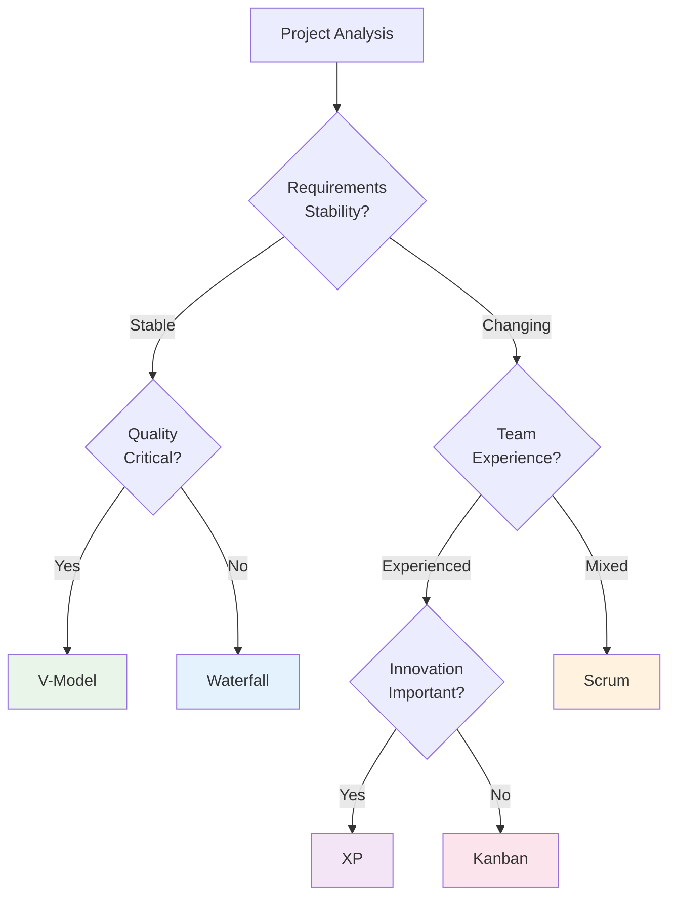
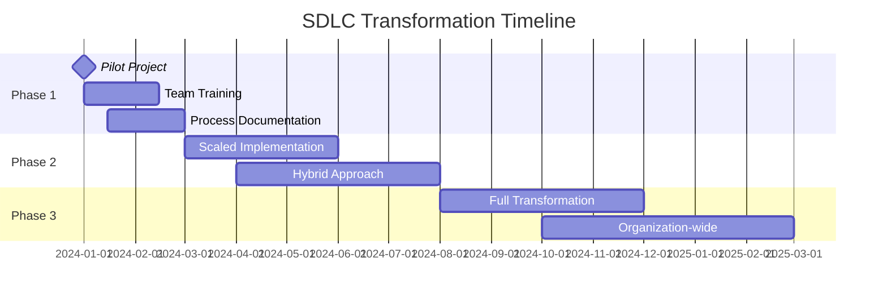

# SDLC Models Comparison Matrix

**Tags:** #SAD #SDLC #Comparison #QuickReference #DecisionSupport #Models
**Last Reviewed:** February 2, 2026

---

## Overview

This comprehensive comparison matrix helps you choose the most appropriate SDLC model based on project characteristics, constraints, and organizational needs.

**Purpose:** *Enable data-driven SDLC model selection through systematic comparison*

## Complete SDLC Models Feature Matrix

| Model | Flexibility | Risk Management | Documentation | Customer Involvement | Best Project Size | Timeline Predictability |
|-------|------------|----------------|---------------|-------------------|------------------|----------------------|
| **Waterfall** | Low | Low-Medium | High | Low | Large | Very High |
| **V-Model** | Low | High | High | Medium | Medium-Large | High |
| **Incremental** | Medium | Medium | Medium | Medium | Medium | Medium |
| **Spiral** | High | Very High | Medium | High | Large-Complex | Low-Medium |
| **Agile/Scrum** | Very High | Medium | Low | Very High | Small-Medium | Low |
| **Kanban** | Very High | Low | Very Low | High | Any | Very Low |
| **XP** | High | Medium | Low | High | Small | Low |

## Decision Support Framework

### When to Choose Each Model

### Project Characteristics Decision Matrix

| Characteristic | Waterfall | V-Model | Spiral | Agile | Recommendation Score (1-5) |
|----------------|-----------|---------|--------|-------|---------------------------|
| **Well-defined requirements** | 5 | 5 | 3 | 2 | Choose sequential models |
| **Changing requirements** | 1 | 1 | 4 | 5 | Choose adaptive models |
| **High-risk project** | 2 | 3 | 5 | 3 | Consider Spiral or risk-heavy approach |
| **Regulatory compliance** | 5 | 5 | 4 | 2 | Choose documentation-heavy models |
| **Quick time-to-market** | 1 | 2 | 3 | 5 | Choose iterative/agile approaches |
| **Large, complex system** | 4 | 4 | 5 | 2 | Consider structured approaches |
| **Small, innovative project** | 1 | 1 | 2 | 5 | Choose agile methodologies |

## Industry-Specific Model Preferences

### Healthcare & Life Sciences
- **Primary:** V-Model, Waterfall
- **Reason:** FDA validation, patient safety, extensive documentation
- **Example:** Medical device software, clinical trial systems

### Financial Services
- **Primary:** Spiral, V-Model
- **Reason:** Risk management, regulatory compliance, high reliability
- **Example:** Trading systems, banking platforms

### Startups & Innovation
- **Primary:** Scrum, XP, Kanban
- **Reason:** Speed, flexibility, rapid iteration
- **Example:** Mobile apps, SaaS platforms

### Government & Defense
- **Primary:** Waterfall, Spiral
- **Reason:** Formal processes, extensive documentation, risk management
- **Example:** Defense systems, citizen services

### E-commerce & Retail
- **Primary:** Agile, Kanban
- **Reason:** Market responsiveness, continuous improvement
- **Example:** Online stores, inventory systems

## Model Transition Strategies

### From Traditional to Agile

### Hybrid Model Approaches

| Situation | Hybrid Solution | Benefits | Challenges |
|-----------|-----------------|----------|------------|
| **Large Enterprise** | Waterfall planning + Agile execution | Structure + flexibility | Coordination complexity |
| **Regulated + Innovation** | V-Model core + Agile features | Compliance + speed | Process integration |
| **Multi-vendor Projects** | Waterfall contracts + Scrum delivery | Clear scope + adaptability | Stakeholder alignment |

## Common Selection Mistakes

### Anti-Patterns to Avoid

| Mistake | Description | Consequence | Better Approach |
|---------|-------------|-------------|------------------|
| **Methodology Religion** | Forcing one model everywhere | Poor project fit, resistance | Match model to project needs |
| **Ignoring Team Maturity** | Choosing advanced methods for new teams | Implementation failure | Gradual capability building |
| **Overlooking Culture** | Imposing contrary organizational methods | Change resistance | Cultural alignment first |
| **Tool-First Thinking** | Choosing model based on tools owned | Process-tool mismatch | Process first, tools second |

## Assessment Worksheet

### Project Evaluation Checklist

**Rate each factor (1-5 scale) for your project:**

| Factor | Rating | Weight | Weighted Score |
|--------|--------|--------|----------------|
| Requirements stability | ___/5 | x3 | ___ |
| Risk tolerance | ___/5 | x2 | ___ |
| Customer availability | ___/5 | x2 | ___ |
| Team experience | ___/5 | x2 | ___ |
| Time constraints | ___/5 | x3 | ___ |
| Quality requirements | ___/5 | x2 | ___ |
| Project complexity | ___/5 | x2 | ___ |
| **Total Score** | | | **___/80** |

**Interpretation:**
- **60-80:** Traditional models (Waterfall, V-Model)
- **40-59:** Balanced approaches (Spiral, Incremental)
- **20-39:** Agile methodologies (Scrum, XP)

## Related Concepts

- **Previous:** [Traditional Sequential Models](../02-SDLC-Models-Methodologies/01-Traditional-Sequential-Models.md)
- **See Also:** [Agile vs Traditional Comparison](../02-SDLC-Models-Methodologies/06-Agile-Methodology.md)
- **Tools:** [Project Planning Techniques](../03-Project-Initiation-Planning/)