# Introduction to System Analysis and Design

**Tags:** #SAD #Fundamentals #Analysis #Design #CoreConcepts
**Last Reviewed:** February 2, 2026

---

## 1. System Analysis

**Definition:** The process of studying an existing system (or business need) to identify its objectives, requirements, and problems.

**Key Characteristics:**
- **Focus:** Understanding the "what" and "why"
- **Key Question:** "What does the business need, and what problems are we solving?"
- **Activities:** Gathering requirements, analyzing processes, modeling current systems, identifying gaps

## 2. System Design

**Definition:** The process of planning and specifying a new system that meets the requirements identified during analysis.

**Key Characteristics:**
- **Focus:** Creating the "how"
- **Key Question:** "How will we build a system to meet these needs?"
- **Activities:** Architectural design, interface design, database design, specifying software/hardware

## 3. The Relationship between Analysis & Design

**Key Principle:** *Analysis feeds design; design implements analysis*

## 4. Importance of SAD

| Benefit | Description | Impact |
|---------|-------------|--------|
| **Business Alignment** | Ensures technology solutions solve real business problems | Strategic value delivery |
| **Complexity Management** | Breaks down large problems into manageable parts | Reduced project risk |
| **Risk Reduction** | Identifies issues before building (saves time/money) | Cost and time savings |
| **Communication** | Creates common language between stakeholders | Improved collaboration |
| **Quality Assurance** | Structured approach leads to robust, maintainable systems | Long-term reliability |

## 5. SAD Mindset: Think like an Analyst

**Core Principles:**
- **Problem-Oriented Approach:** Understand the root cause before jumping to solutions
- **Dual Perspective:** See both the big picture and the details (forest and trees)
- **Multi-Language Communication:** Speak business language, technical specs, and visual models
- **Change Adaptation:** Requirements evolve; design must adapt

## 6. Real-World Analogy: Building a House

| Phase | House Building | System Development |
|-------|----------------|--------------------|
| **Analysis** | Talk to family about needs, survey land, check zoning laws | Gather business requirements, assess current system, identify constraints |
| **Design** | Create blueprints, electrical plans, material lists | Design architecture, interfaces, database schema |
| **Without SAD** | Start building and hope it works out | Start coding without planning (recipe for disaster) |

## Detailed Case Studies

### Case Study 1: E-Commerce System Development

**Business Problem:** Small retailer wants to expand online

| Phase | Analysis Activities | Design Activities | Deliverables |
|-------|-------------------|------------------|-------------|
| **Planning** | Market research, competitor analysis | Technology stack selection | Business case, feasibility study |
| **Requirements** | Customer journey mapping, feature prioritization | User interface wireframes | Requirements specification |
| **Design** | Database schema, payment integration | API design, security protocols | System architecture document |
| **Result** | 40% increase in sales, 24/7 availability | Customer satisfaction improved | ROI achieved in 8 months |

### Case Study 2: Healthcare Management System

**Business Problem:** Clinic needs digital patient records

**Analysis Phase:**
- **Stakeholders:** Doctors, nurses, patients, administration, IT staff
- **Current State:** Paper records, appointment scheduling issues, billing errors
- **Requirements:** HIPAA compliance, integration with lab systems, mobile access

**Design Phase:**
- **Architecture:** Cloud-based, role-based access control
- **Database:** Patient records, appointment scheduling, billing integration
- **Interface:** Tablet-friendly for doctors, web portal for patients

**Outcome:** 60% reduction in paperwork, 99.9% uptime, full regulatory compliance

### Case Study 3: University Course Registration System

**The SAD Process in Action:**

```mermaid
flowchart TD
    A["📊 ANALYSIS<br/>- Interview students/faculty<br/>- Document current paper process<br/>- Identify pain points"] --> B["🎯 REQUIREMENTS<br/>- Online registration<br/>- Conflict detection<br/>- Waitlist management"]
    B --> C["🏗️ DESIGN<br/>- Database schema<br/>- User interface mockups<br/>- Integration with existing systems"]
    C --> D["⚡ RESULT<br/>- Registration time: 3 hours → 15 minutes<br/>- Error reduction: 85%<br/>- Student satisfaction: 94%"]
```

## Real-World Applications by Industry

| Industry | Typical SAD Projects | Analysis Focus | Design Challenges |
|----------|---------------------|----------------|-------------------|
| **Banking** | Online banking, fraud detection | Security, compliance, transaction volume | Real-time processing, data encryption |
| **Healthcare** | Electronic health records, telemedicine | Patient privacy, integration with devices | HIPAA compliance, user-friendly interfaces |
| **Education** | Learning management systems, student portals | User experience, scalability | Multi-device access, content management |
| **Retail** | E-commerce, inventory management | Customer journey, supply chain | Payment processing, recommendation engines |
| **Manufacturing** | Supply chain, quality control | Process optimization, compliance | Integration with machinery, real-time monitoring |

## Practical Exercises

### Exercise 1: Analysis vs. Design Classification 🎯

**Instructions:** Classify each activity as either Analysis (A) or Design (D)

1. Creating database table structures ( )
2. Interviewing users about their needs ( )
3. Choosing programming languages ( )
4. Documenting current business processes ( )
5. Designing user interface mockups ( )
6. Identifying system requirements ( )

**Answers:** 1-D, 2-A, 3-D, 4-A, 5-D, 6-A

### Exercise 2: Restaurant Ordering System Scenario 🍕

**Scenario:** A small restaurant wants to implement an online ordering system.

**Your Task:** Complete the SAD planning

| Analysis Questions | Your Answers | Design Decisions | Your Solutions |
|--------------------|-------------|------------------|----------------|
| What menu items to offer online? | _______________ | How to display the menu? | _______________ |
| What payment methods to accept? | _______________ | Database structure for orders? | _______________ |
| How to handle delivery/pickup? | _______________ | User interface design? | _______________ |
| Integration with kitchen systems? | _______________ | Order tracking system? | _______________ |

### Exercise 3: Stakeholder Impact Assessment 👥

**Scenario:** University implementing new grade management system

**Task:** Identify potential concerns for each stakeholder

| Stakeholder | Primary Concerns | How SAD Helps |
|-------------|------------------|---------------|
| **Students** | Easy grade access, privacy | _______________ |
| **Faculty** | Simple grade entry, security | _______________ |
| **Admin Staff** | Report generation, compliance | _______________ |
| **IT Department** | System maintenance, integration | _______________ |
| **Parents** | Grade transparency, notifications | _______________ |

### Exercise 4: SAD Failure Analysis 💥

**Case:** A software project failed because developers started coding immediately after getting a verbal description of the requirements.

**Questions:**
1. What SAD principles were violated?
2. What problems likely occurred during development?
3. How could proper SAD have prevented these issues?
4. What would you do differently?

### Self-Assessment Quiz ✅

**Rate your understanding (1-5 scale):**
- [ ] I can distinguish between analysis and design activities
- [ ] I understand why SAD is important for project success
- [ ] I can identify stakeholders for a given system
- [ ] I can explain SAD benefits to a business manager
- [ ] I'm ready to learn specific SAD methodologies

## Related Concepts

- **Previous:** [General System Model](intro_to_systems/)
- **Next:** [The Systems Analyst Role](1.5%20-%20The_Systems_Analyst_Role.md)
- **See Also:** [SDLC Overview](1.6%20-%20SDLC_Overview.md)