# As-Is vs. To-Be Analysis Framework

**Tags:** #SAD #Analysis #Methodology #ProcessImprovement #Transformation
**Last Reviewed:** February 2, 2026

---

## Overview

As-Is vs. To-Be Analysis is a fundamental methodology for understanding current state limitations and designing future state improvements. This systematic approach ensures comprehensive analysis and successful transformation planning.

**Core Philosophy:** *"You can't improve what you don't understand, and you can't plan where you're going without knowing where you are."*

```mermaid
flowchart TD
    A[Current Reality<br/>AS-IS STATE] --> B[Gap Analysis]
    B --> C[Future Vision<br/>TO-BE STATE]
    B --> D[Transformation Plan]
    D --> E[Implementation]
    E --> F[Continuous Improvement]
    
    A1["🔍 Document current processes<br/>📊 Identify pain points<br/>📈 Measure performance"] --> A
    C1["✨ Design improved processes<br/>🎯 Set target metrics<br/>🚀 Enable new capabilities"] --> C
    
    style A fill:#ffebee
    style C fill:#e8f5e8
    style B fill:#fff3e0
    style D fill:#e3f2fd
```

## The Fundamental Framework

| Aspect | As-Is System | To-Be System | Analysis Focus |
|--------|--------------|--------------|----------------|
| **Definition** | Current state with all flaws, limitations, manual processes | Future state after analysis, design, and implementation | Gap identification and transformation planning |
| **Purpose** | Establish baseline understanding | Define transformation target | Bridge current reality to future vision |
| **Focus** | What exists now | What should exist | How to get there |
| **Perspective** | Reality-based | Vision-driven | Change-oriented |

## Strategic Importance Matrix

### Why As-Is vs. To-Be Analysis Matters

| Business Value | Description | Impact Level | Risk of Skipping |
|----------------|-------------|--------------|-------------------|
| **Baseline Understanding** | Document current state comprehensively | High | Incomplete requirements, missed dependencies |
| **Gap Analysis** | Identify specific improvement opportunities | Critical | Unfocused solutions, wasted resources |
| **Stakeholder Alignment** | Create shared vision of transformation | High | Conflicting expectations, resistance to change |
| **Scope Control** | Define transformation boundaries clearly | Medium | Scope creep, budget overruns |
| **Risk Mitigation** | Anticipate implementation challenges | High | Project failure, user adoption issues |

## System Types Classification

### As-Is System Categories

```mermaid
flowchart TD
    A[As-Is Systems] --> B[Manual Systems]
    A --> C[Legacy Digital]
    A --> D[Hybrid Systems]
    A --> E[Modern but Limited]
    
    B --> B1["📋 Paper-based processes<br/>📊 Spreadsheet management<br/>📁 Physical file systems"]
    C --> C1["💾 Outdated software<br/>🔧 Mainframe systems<br/>⚡ Limited integration"]
    D --> D1["🔄 Mixed manual/digital<br/>📱 Partial automation<br/>🔗 Disconnected tools"]
    E --> E1["✅ Current technology<br/>❌ Limited functionality<br/>🚧 Scalability issues"]
    
    style B fill:#ffebee
    style C fill:#fff3e0
    style D fill:#f3e5f5
    style E fill:#e8f5e8
```

### Real-World As-Is Examples

| System Type | Industry Example | Key Limitations | Transformation Driver |
|-------------|------------------|-----------------|----------------------|
| **Manual** | Law firm using paper files for case management | Time-consuming searches, risk of loss, limited collaboration | Digital case management with search and sharing |
| **Legacy Digital** | Bank with 1990s core banking system | Limited online features, maintenance costs, integration challenges | Modern core banking with API ecosystem |
| **Hybrid** | Hospital with electronic records but paper scheduling | Data inconsistency, duplicate entry, workflow inefficiency | Integrated healthcare management platform |
| **Modern Limited** | E-commerce site that can't handle mobile traffic | Lost sales, poor user experience, competitive disadvantage | Responsive, scalable e-commerce platform |

- **Hybrid Systems:** Mix of manual and digital processes.

# 4. The Analysis Process Flow:

      Study Current
    ┌───────────────┐
    │   [As-Is]     │ ← Interview users, observe processes,
    │   System      │    review documents, identify pain points
    └───────────────┘
           ↓
    ┌───────────────┐
    │   Identify    │ ← Find gaps, inefficiencies,
    │  Improvements │    manual bottlenecks, errors
    └───────────────┘
           ↓
    ┌───────────────┐
    │   Design      │ ← Create the blueprint for the
    │   [To-Be]     │    improved, error-proof system
    └───────────────┘

# 5. *Example: Money Management Company*

- **As-Is:** Manual table with columns (Client Name, Amount, Date, etc.)

- **To-Be:** Digital system with:

    - **Same columns** (must preserve existing data structure)

    - **New columns** (added functionality)

    - **Data validation** (date pickers, formatted fields)

    - **Error-proofing** (cannot enter invalid dates/amounts)

# 6. Key Principle: Error-Proof Design (Poka-yoke)

- **Goal:** "Design a system so good the user cannot make mistakes."

- **Techniques:**

    - **Constrained Inputs:** Dropdowns, date pickers (not free-text fields)

    - **Validation Rules:** "Date must be in dd/mm/yyyy"

    - **Defaults:** Pre-selected sensible options

    - **Confirmation Steps:** "Are you sure?" for critical actions

- **Global Consideration:** If system is international → use calendar pickers, not culture-specific date formats.

# 7. Strategic Approach to Studying As-Is Systems (From Notes):

- **If manual:** Look at local → global examples of similar systems.

- **If digital/legacy:** Analyze what can be improved; don't rebuild large global systems from scratch.

- **Talk to the right people:** System managers, not subjective opinion-holders.

- **If starting from scratch (all manual):** Research local competitors → global best practices.

# 8. The "Hyper-Critical Zone" & Support Reality:

- **Fact:** After a system launches, the team enters 24/7 support mode.

- **Implication:** The To-Be system must be exceptionally robust—post-launch fixes are high-pressure and costly.

- **Fintech Context:** High pay reflects this immense responsibility.

# 9. Links:

- **Back to:** [1.6 SDLC Overview]()

- **Forward to:** [Section Group 4 (Requirements) where this analysis is applied]()